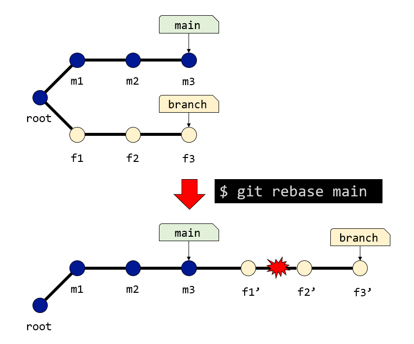

# Gitの使い方(応用編)

## Gitトラブルシューティング

Gitを使っていると、たまに「しまった！」と思うことがある。Gitに慣れていないとトラブルが起きた時に何が起きたかわからず、適切に対処することが難しい。以下ではありがちなトラブルとその対処について説明する。

### コミットメッセージを間違えた(`git commit --amend`)

Gitはコミットの際にメッセージをつけることが必須である。ちゃんとエディタで書く人もいるだろうが、コマンドラインから`git commit -m`でメッセージを書いてしまうことが多いだろう。その際、コミットの後に「あ！打ち間違えた！」と思うことがある。

たとえば`test.txt`を修正し、`git add`、`git commit`したとしよう。

```sh
git add test.txt
git commit -m "updaets test.txt"
```

そしてコミット直後に「あ！`updates`を打ち間違えている！」と気づくが、すでに歴史に間違いが刻まれてしまった。

```sh
$ git log --oneline
8f7d4f8 (HEAD -> main) updaets test.txt
78efaf0 initial commit
```

このままではとてもかっこ悪い歴史が残ってしまう。そこで、`git commit --amend`を実行することで、直前のコミットのコミットメッセージを修正することができる。そのまま実行するとエディタが開くが、`-m`も指定してメッセージを上書きするのが楽であろう。

```sh
git commit --amend -m "updates test.txt"
```

歴史を確認しよう。

```sh
$ git log --oneline
52304ef (HEAD -> main) updates test.txt
78efaf0 initial commit
```

無事にコミットメッセージが書き換えられた。

なお、ここで先ほどとコミットハッシュが変わっている(`8f7d4f8`→`52304ef`)ことに注意したい。`git commit --amend`によりコミットメッセージを修正すると、コミットハッシュが変わってしまう。`git rebase`の時と同様に歴史がおかしくなるため、`git push`した後には`git commit --amend`を実行してはならない[^push]。

[^push]: 個人開発であれば強制プッシュ(`git push -f`)するという手もあるが、GitHubに強制プッシュの履歴が残り、やはりあまりかっこよくない。そもそも`main`ブランチで作業するのがよくないため、常に別ブランチで作業するようにして、`main`ブランチにリベースしてコミットやメッセージを整理してからマージする習慣をつけたい。

### 修正を取り消したい(`git restore`)

ファイルを修正したが、その修正をなかったことにしたい、ということがある。例えば、最後にコミットした状態から`test.txt`に修正が加えられたとしよう。`git diff`はこうなっている。

```sh
$ git diff
diff --git a/test.txt b/test.txt
index e965047..4f34f18 100644
--- a/test.txt
+++ b/test.txt
@@ -1 +1,2 @@
 Hello
+Modification to be undone
```

「Modification to be undone」という行が追加されている。これを取り消すには、`git restore ファイル名`とする。

```sh
git restore test.txt
```

これにより、`test.txt`は最後にコミットした状態に戻る。なお、`git restore`はオプションを指定しなかった場合`--worktree`が付く。これはワーキングツリーのファイルを修正する。`--worktree`は`-W`でも良い。

### ステージングを取り消したい(`git restore --staged`)

先ほどの修正をした後、`git add`までした状態を考える。

```sh
$ git diff --staged
diff --git a/test.txt b/test.txt
index e965047..5c936d2 100644
--- a/test.txt
+++ b/test.txt
@@ -1 +1,2 @@
 Hello
+Modification to be undone
```

ステージングした状態を取り消すには`git restore --staged ファイル名`とする。

```sh
git restore --staged test.txt
```

これで、先ほどの「最後のコミットからワーキングツリーのみ修正された状態」に戻る。`--staged`は`-S`でも良い。

あまりないと思うが、ワーキングツリーとインデックス両方に修正がある場合は`-W -S`で両方一度に取り消すことができる。

```sh
$ git status -s
MM test.txt      # ワーキングツリーとインデックス両方に修正がある

$ git restore -W -S test.txt # 両方一度に取り消し
```

### `git checkout`は使わない

`git switch`と`git restore`はGitのバージョン2.23.0から追加された機能であり、それまでは`git checkout`や`git reset`がその役目を担っていた。

例えば以下は同じ意味だ。

```sh
git checkout feature
git switch feature
```

また、ステージングされていないファイルの修正も`git checkout`でできる。以下は同じ意味だ。

```sh
git checkout test.txt
git restore test.txt
```

もともと、`git checkout`に役目が多すぎたためにコマンドが分けられた背景がある。現在、`git checkout`を使う必要はほとんどない。また、`git switch`と異なり、`git checkout`は直接コミットハッシュを指定することができる。

例えば、いまカレントブランチが`main`であり、コミット`9b662ef`を指している状態であるとしよう。

```sh
$ git log --oneline
9b662ef (HEAD -> main) test
```

この状態で`9b662ef`を指定して`git checkout`すると、`HEAD`がブランチではなく、直接コミットハッシュを指す「detached HEAD」状態となる。

```sh
$ git checkout 9b662ef
Note: switching to '9b662ef'.

You are in 'detached HEAD' state. You can look around, make experimental
changes and commit them, and you can discard any commits you make in this
state without impacting any branches by switching back to a branch.

If you want to create a new branch to retain commits you create, you may
do so (now or later) by using -c with the switch command. Example:

  git switch -c <new-branch-name>

Or undo this operation with:

  git switch -

Turn off this advice by setting config variable advice.detachedHead to false

HEAD is now at 9b662ef test
```

ブランチを介さないでGitを操作するのは事故のもとである。一方、`git switch`は直接コミットを指定することはできず、コミットハッシュとブランチ名を同時に指定する必要がある。

```sh
$ git switch -c newbranch 9b662ef
Switched to a new branch 'newbranch'
```

したがって、`git checkout`の代わりに`git switch`を使った方が良い。同様な理由でファイルの修正を元に戻すのも`git restore`を使った方が良い。古い本やサイトには、まだ`git checkout`を使う方法が説明されていたりするので注意が必要だ。

### リモートを間違えて登録した(`git remote remove`)

GitHubを使っていて、リモートリポジトリのアドレスを間違えることがよくある。例えば、GitHubで新しいリポジトリを作り、そこに既存のリポジトリをプッシュしようとして、

```sh
git remote add origin https://github.com/appi-github/somerepository.git
git branch -M main
git push -u origin main
```

を実行してusernameを聞かれ、「あっ！SSHのつもりがHTTPSを選んじゃった」と気が付いた時だ。ここで、改めて

```sh
git remote add origin git@github.com:appi-github/somerepository.git
```

と、SSHで再登録しようとしても、「error: remote origin already exists.」とつれない返事が返ってくる。この時、まず`origin`として登録されたリモートを削除してから再登録すれば良い。

```sh
git remote remove origin
```

これで、リモートリポジトリ`origin`は削除されたので、改めてSSHプロトコルで再登録すれば良い。

```sh
git remote add origin git@github.com:appi-github/somerepository.git
```

### メインブランチで作業を開始してしまった(`git stash`)

Gitでは原則としてメインブランチでは作業せず、必ずフィーチャーブランチを切って作業する。ところが、ファイルを修正した後で「あっ！メインブランチで作業してた！」と気が付いたとしよう。そんな時は`git stash`を使う。`git stash`はコミットを作らずに変更を退避するコマンドだ。

今、`main`ブランチにいるまま`test.txt`を結構修正してしまった状態にある。

```sh
$ git status
On branch main
Changes not staged for commit:
  (use "git add <file>..." to update what will be committed)
  (use "git restore <file>..." to discard changes in working directory)
        modified:   test.txt

no changes added to commit (use "git add" and/or "git commit -a")
```

この状態で`git stash`を実行すると、最後のコミットからの修正が退避される。

```sh
$ git stash  # 修正が退避される
Saved working directory and index state WIP on main: 57222d5 update

$ git status # カレントブランチはきれいな状態に戻る
On branch main
nothing to commit, working tree clean
```

`git stash`はスタックになっており、どんどん修正を積み上げることができる。積み上げた修正は`git stash list`で見ることができる。

```sh
$ git stash list
stash@{0}: WIP on main: 57222d5 update
```

積んだ修正は`git stash pop`で適用できる。新しいブランチを切ってから適用しよう。

```sh
$ git switch -c feature
Switched to a new branch 'feature'

$ git stash apply pop
On branch feature
Changes not staged for commit:
  (use "git add <file>..." to update what will be committed)
  (use "git restore <file>..." to discard changes in working directory)
        modified:   test.txt

no changes added to commit (use "git add" and/or "git commit -a")
Dropped refs/stash@{0} (171f9ddd0c02ed7e7ed9105aa9ef30f3553aa742)
```

これにより、あたかも「最初から`feature`ブランチを切ってから修正をした」ような状態となった。あとはキリの良いところまで作業してコミットし、`main`ブランチにマージするなりその前にリベースするなりすれば良い。うっかりメインブランチで作業を開始しがちな人(例えば私)は覚えておきたいコマンドだ。

なお、`git stash`を実行するたびに修正が詰みあがっていく。それぞれに`stash@{0}`、`stash@{1}`という名前がつき、`git stash apply`により名前を指定して適用することもできる。しかし、その場合は適用した修正がスタックに残るため、後で`git stash drop`で消さなければならない。一方、`git stash pop`は、最後に積んだ修正を適用し、その修正をスタックから削除する。

あまり積むと後で見てわからなくなるので、原則として`git stash`は`git stash pop`と対で利用すると良い。

### プッシュしようとしたらリジェクトされた

あなたは家で作業をして、一段落したのでコミット、プッシュしてから寝ようとしたら、無情にも`rejected`というメッセージが出て拒否された。

```sh
To /URL/to/test.git
 ! [rejected]        main -> main (fetch first)
error: failed to push some refs to '/URL/to/test.git'
hint: Updates were rejected because the remote contains work that you do
hint: not have locally. This is usually caused by another repository pushing
hint: to the same ref. You may want to first integrate the remote changes
hint: (e.g., 'git pull ...') before pushing again.
hint: See the 'Note about fast-forwards' in 'git push --help' for details.
```

そこであなたは、大学で修正をプッシュしたのに、家のリポジトリで`git fetch`、`git merge`するのを忘れていたことに気が付く。もしプロジェクトがバージョン管理されておらず、プッシュではなく単に大学のサーバにアップロードをしていたら、大学での修正は失われてしまっていたかもしれない。しかし、幸運なことにあなたはGitを使っており、大学で行った修正がGitHubに、家で行った修正がローカルにある。この状態で、まず学校の修正をローカルに持ってこよう。

```sh
git fetch
```

これにより、ローカルの`origin/main`が大学で行った作業を反映したコミットを指すようになった。ローカルの`main`と、`origin/main`は、同じコミットから歴史が分岐した状態だ。これを一つにするにはマージすれば良い。

```sh
git merge origin/main
```

もし衝突したら、適切に修正して`git add`、`git commit`すれば良い。これで両方の修正を取り込んだ新たな歴史ができた。この歴史は、リモートの`main`と歴史を共有しているので、そのまま`git push`ができる。

```sh
git push # 問題なく実行できる
```

家と大学など、複数の場所で開発を進めることはよくあるであろう。その時、一方でpushを忘れてしまったり、fetch/mergeするのを忘れてコミットしてしまったりすると、`git push`ができずエラーが起きる。その場合は、慌てずに`git fetch`、`git merge origin/main`してから`git push`すれば良い。

### 頭が取れた(`detached HEAD`)

通常、ブランチがコミットを指し、`HEAD`がブランチを指すことで「カレントブランチ」を表現している。例えば適当なリポジトリで`git log --oneline`を実行すると、

```sh
$ git lone --online
fe81057 (HEAD -> main) updates from test2
4692a78 initial commit
```

などと表示される。これは、`HEAD`が`main`ブランチを指しており(カレントブランチが`main`であり)、`main`ブランチは`fe81057`というコミットを指している状態だ。これにより、`HEAD`は`main`を経由してコミットを指している。

しかし、Gitの操作の途中、`HEAD`がブランチを経由せずにコミットを直接指している状態になることがある。これを`detached HEAD`状態と呼ぶ。

例えば先ほどの状態で`git checkout fe81057`を実行すると、`git status`でこんな表示が出るようになる。

```sh
HEAD detached at fe81057
nothing to commit, working tree clean
```

これは、頭が取れた(`detached HEAD`)状態であり、`HEAD`が直接コミット`fe81057`を指しているよ、という意味だ。`git log --oneline`はこんな表示になる。

```sh
$ git log --oneline
fe81057 (HEAD, main) updates from test2
4692a78 initial commit
```

先ほどは`HEAD -> main`と、`HEAD`が`main`を指していたが、いまは`HEAD`と`main`が個別にコミット`fe81057`を指している状態であることがわかるであろう。

Gitでは、例えば以下の操作で頭が取れる。

* `git checkout`で直接コミットを指定した
* `git rebase`中に衝突した
* `git bisect`の実行中

`git checkout`を直接使うことはあまりないであろう。`git rebase`中の衝突については後述する。`git bisect`の最中によくわからなくなったら、`git bisect reset`を実行して`bisect`から抜けよう。

それ以外で、「なんだかよくわからないが頭が取れてしまった」という状態になったら、まずはいま`HEAD`が指しているコミットにブランチを作って貼っておこう。

```sh
$ git status
HEAD detached at 4692a78
nothing to commit, working tree clean
```

いま、頭が取れて、`HEAD`が`4692a78`を指した状態だ。なぜこの状態になったかがよくわからないとしよう。ならば、後でこの状態に戻ってこられるように、ブランチを付けておこう。

```sh
git branch 20210918_detached_head
```

これで、`4692a78`に`20210918_detached_head`というブランチがついた。この状態で`main`ブランチに戻る。

```sh
git switch main
```

ブランチを見てみよう。

```sh
$ git branch
  20210918_detached_head
* main
```

先ほど頭が取れた状態で`HEAD`が指していたコミットに`20210918_detached_head`というブランチがついている。しばらくそのままにしておいて、不要だと思えば削除すれば良いだろう。ブランチをつけずに`main`に戻ると、先ほどのコミットハッシュ`4692a78`を覚えていない限り、頭が取れた状態に戻ることはできなくなる。「理由もわからず頭が取れてよくわからない状態になったら、ブランチをつけて`main`に戻る」と覚えておけばよい。

### リベースしようとしたら衝突した

リベースとは、リベース先にしたいブランチ(例えば`main`)と、現在のブランチ(例えば`feature`)について、共通祖先から`feature`までの修正を`main`に順番に適用して、できた最後のブランチに`feature`ブランチを移動させる操作だ。一度だけマージが行われる`git merge`とは異なり、パッチの数だけマージ作業が行われる。したがって、パッチの数だけ衝突の可能性がある。また、リベース中に衝突すると、いわゆる頭が取れた(`detached HEAD`)状態になるために焦りがちだ。その時、「リベースは、修正を次々と適用して新しいコミットを作っている」という感覚を持つと対応がイメージしやすい。



いま、上図のような状況を考えよう。`root`というコミットから、`main`と`branch`に歴史が分岐している。ここで`branch`から`main`に対して`git rebase`を実行する。

すると、`root`から`f1`、`f1`から`f2`といった「修正パッチ」を、現在`main`が指している`m3`に適用し、新たに`f1'`、`f2'`、``f3'``というコミットを作ろうとする。

しかしいま、`f1'`を作り、次に`f2'`を作ろうとしたところで衝突が起きてしまった。

```sh
$ git rebase main
Auto-merging test.txt
CONFLICT (content): Merge conflict in test.txt
error: 99a8712を適用できませんでした... f2
Resolve all conflicts manually, mark them as resolved with
"git add/rm <conflicted_files>", then run "git rebase --continue".
You can instead skip this commit: run "git rebase --skip".
To abort and get back to the state before "git rebase", run "git rebase --abort".
Could not apply 99a8712... f2
```

リベース中に衝突が起きると、`detached HEAD`となるため、例えばGit Bashなどでカレントブランチを表示している状態にしていても、ブランチが表示されなくなる。

現在の状態を見てみよう。

```sh
$ git status
interactive rebase in progress; onto 3152c68
Last commands done (2 commands done):
   pick 1c8a63e f1
   pick 99a8712 f2
Next command to do (1 remaining command):
   pick 6aa5661 f3
  (use "git rebase --edit-todo" to view and edit)
You are currently rebasing branch 'branch' on '3152c68'.
  (fix conflicts and then run "git rebase --continue")
  (このパッチをスキップするには"git rebase --skip"を使用してください)
  (use "git rebase --abort" to check out the original branch)

Unmerged paths:
  (use "git restore --staged <file>..." to unstage)
  (use "git add <file>..." to mark resolution)
        both modified:   test.txt

no changes added to commit (use "git add" and/or "git commit -a")
```

大量の情報があるが、

* 現在、リベース中であること (`interactive rebase in progress`)
* `pick 99a8712 f2`を実行したところで止まっていること
* `pick 6aa5661 f3`が残っていること
* 衝突を修正してから`git rebase --continue`を実行するか、リベースを中止して先ほどのブランチに戻るなら`git rebase --abort`を実行して欲しいこと

などが書いてある。繰り返しになるが、Gitのメッセージは非常にていねいかつ有用なので、「ちゃんと読む」のがGit上達の近道だ。

さて、先ほどの図を見るとわかる通り、このリベースで作ろうとしているコミットは3つだ。そのうち二つ目の`f2'`を作るところで止まっている。したがって今やるべきことは、`f2'`のあるべき姿をインデックスに再現してコミットし、リベースを続行することだ。

衝突が起きているファイル`test.txt`を確認し、両方の修正を取り込んだら、`git add`、`git commit`しよう。

```sh
$ git add test.txt
$ git commit -m "merge"
[detached HEAD 10876ee] merge
 1 file changed, 1 insertion(+), 1 deletion(-)
```

「頭が取れているよ (`detached HEAD`)」という警告が出るが気にしなくて良い。この状態で`git rebase --continue`を実行すれば、無事にリベースが完了し、`HEAD`が`branch`を指して`detached HEAD`が解消する。

```sh
$ git rebase --continue
Successfully rebased and updated refs/heads/branch.
```

「Gitのリベースとは、共通祖先からの修正をリベース先に次々と適用して、新しいコミットを作っていくこと」だと理解していれば、なぜ衝突が複数回起きる可能性があるのか、なぜ`git add`が衝突解決をGitに教えたことになるのかが理解しやすいであろう。`git add`は衝突解決をGitに教えるコマンドではなく、あくまでもインデックスに修正をステージするコマンドであり、リベース中のステージングは、「次に作るべきコミットの姿をGitに教える」という役割を果たしている。

Gitのリベースは理解が難しいため、特に個人開発の場合は、慣れるまでは`git merge`を使う、という運用で良い。Gitに慣れ、後でデバッグする時に歴史が整理されていないのが気になりはじめところで`git rebase`を使い始めると良いだろう。

## その他の便利なコマンド

### この部分はいつ誰が書いた？(`git blame`)

多人数開発をしていると、頻繁に「この部分はいつ誰が書いたんだ？」と思うことであろう。個人開発をしていてもたまに「これ誰が書いたんだよ！」と思うことが多い(もちろん自分である)。そんな時に便利なコマンドが`git blame`だ。

いま、こんなPythonスクリプトがあったとしよう。

```py
def func1():
    print("Hello func1")


def func2():
    print("Hello func2")


if __name__ == '__main__':
    print("Hello")
    func1()
    func2()
```

`git blame`にファイル名を指定すると、どの行が、いつ、誰によって修正されたかが表示される。

```sh
$ git blame test.py
56127fbb (H. Watanabe 2021-09-17 21:22:49 +0900  1) def func1():
56127fbb (H. Watanabe 2021-09-17 21:22:49 +0900  2)     print("Hello func1")
56127fbb (H. Watanabe 2021-09-17 21:22:49 +0900  3)
56127fbb (H. Watanabe 2021-09-17 21:22:49 +0900  4)
26bdec20 (H. Watanabe 2021-09-17 21:23:31 +0900  5) def func2():
26bdec20 (H. Watanabe 2021-09-17 21:23:31 +0900  6)     print("Hello func2")
26bdec20 (H. Watanabe 2021-09-17 21:23:31 +0900  7)
26bdec20 (H. Watanabe 2021-09-17 21:23:31 +0900  8)
^fea5775 (H. Watanabe 2021-09-17 21:22:08 +0900  9) if __name__ == '__main__':
^fea5775 (H. Watanabe 2021-09-17 21:22:08 +0900 10)     print("Hello")
26bdec20 (H. Watanabe 2021-09-17 21:23:31 +0900 11)     func1()
26bdec20 (H. Watanabe 2021-09-17 21:23:31 +0900 12)     func2()
```

これを見れば、`func1`や`func2`がいつ作られたかがわかる。`git blame`には行を指定したり、コミットハッシュを指定したりするなど多くのオプションがあるが、エディタや統合環境と一緒に使うことがほとんどであろう。

個人開発でバグに気が付いた時、どの関数がどの順番で作られたかは非常に有用な情報なので、個人開発でも役に立つ。

### このバグが入ったのはいつだ？(`git bisect`)

プログラムをずっと開発していて、ある時にバグに気が付いたとする。最近入れたバグならデバッグは比較的容易だが、ずいぶん前に入れてしまったバグが今になって顕在化した場合はやっかいだ。三日前の自分は全くの他人であり、そのバグの振る舞いからどこでどういう経緯でバグが入ったかをすぐに特定することは難しいであろう。しかし、少なくとも昔はバグが入っていなかった時があり、現在はバグっているのだから、どこかに「バグが混入したコミット」が存在するはずだ。これを二分探索で調べるためのコマンドが`git bisect`である。

今、バグが入ったことが気が付いたブランチがある。例えばカレントブランチである`main`が指しているコミットはバグっているとしよう。そして、適当に探した昔のコミット`e34d733`はバグってなかったことが確認できたとしよう。バグはこの二つのコミットの間にある。二分探索を開始しよう。`git bisect start 問題のある場所 問題のない場所`を実行する。場所はコミットハッシュやブランチで指定できる。

```sh
git bisect start main e34d733
```

これによりGitは二分探索モードとなり、まずは適当なコミットを持ってくる。このコミットがバグっているかどうかGitに教えてやろう。もしバグっていたら

```sh
git bisect bad
```

もし問題がなければ

```sh
git bisect good
```

を実行する。その度にGitは問題の範囲を狭めていき、最終的にバグが混入したコミットを見つけてくれる。

```sh
$ git bisect bad
e6348e408b57fdb42eb1281cb77b5c331cd400e7 is the first bad commit
(snip)
```

上記は、最後に`git bisect bad`を実行したら、それによりGitが問題箇所を特定し、`e6348e4`が問題の入ったコミットだよ、と教えてくれた。ここで`git diff`を取ったりいろいろできるが、とりあえず発見されたコミットに「バグった印」としてブランチをつけて置くと良い。

```sh
git branch bug e6348e4
```

これで、問題の入ったコミットに`bug`というブランチがついた。二分探索モードを抜けよう。

```sh
git bisect reset
```

後は先ほどつけた`bug`の時点に`git switch`で戻って詳細を調べれば良い。特に、ここで初めてバグが入ったのだから、一つ前のコミットとの差分が重要な情報となるだろう。

```sh
git switch bug
git diff HEAD^
```

今回は手動で`good`/`bad`判定をしたが、判定を自動実行するシェルスクリプトが書けるなら、上記の動作を自動化できる。例えば現在のリポジトリの状態に対して、問題がなければ成功(終了ステータス0を返す)、問題があれば失敗(終了ステータス1を返す)ような`test.sh`というシェルスクリプトがあるなら、

```sh
git bisect start main e34d733
git bisect run ./test.sh
```

と`git bisect run`コマンドにそのスクリプトを渡すだけで自動的に二分探索してくれる。一般に二分探索は非常に効率が良く、数回も実行すれば問題のコミットを特定できるが、いちいち`git bisect good/bad`と入力するのも面倒だし、また人力だと間違えることもあるので、可能なら自動化したい。これらについては後に演習で実際に体験する。

## まとめ

Gitで直面しがちなトラブルとその対処法や、知っていると便利なコマンドについて紹介した。Gitのコマンドが実際に何をやっているかを理解していないと、トラブルの対処が難しい。単に「こういう場合はこうすれば良い」と場当たり的な対処を覚えるのではなく、「いまこういう状態で」「ここを解決したいのでこのコマンドを使っている」といったイメージを大事にして欲しい。
