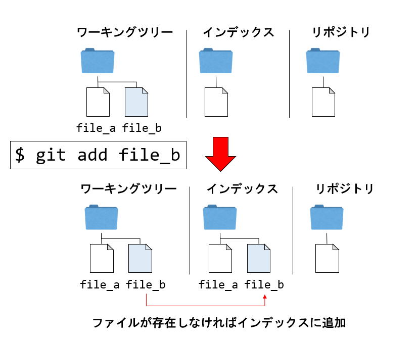
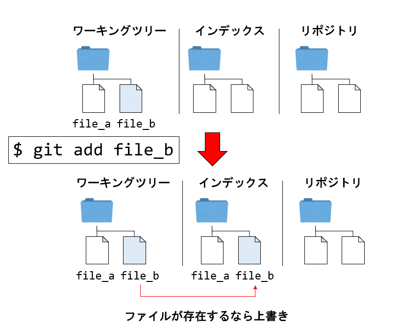
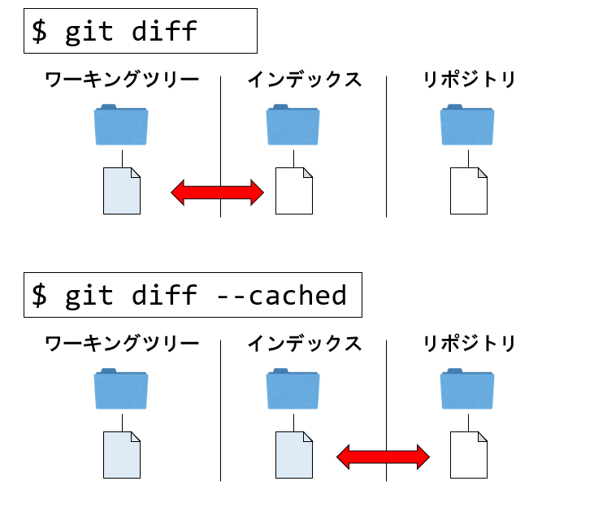

# Gitの基本的な使い方

## はじめに

それではいよいよGitの操作を見ていこう。Gitは「git コマンド オプション 対象」といった形で操作する。Gitには大量のコマンドがあり、さらにそれぞれに多くのオプションがある。それらを全て覚えるのは現実的ではない。まずはよく使うコマンドとオプションだけ覚えよう。また、Gitはヘルプが充実している。「あのコマンドなんだっけ？」と思ったら、`git help`を実行しよう。また、コマンドの詳細を知りたければ`git help command`で詳細なヘルプが表示されるので、合わせて覚えておくこと。たとえば`git help help`で、`help`コマンドのヘルプを見ることができる。

Gitに限らず、使い方がわからないコマンドがあった時に、まずは公式ドキュメントやヘルプを参照する癖をつけておきたい。広く使われているツールは、公式のドキュメントやチュートリアルが充実していることが多い。例えばGitであれば[Pro Git](https://git-scm.com/book/ja/v2)というGitの本がウェブで公開されている。また、`git help`で表示されるヘルプも非常に充実している。公式ドキュメント及びヘルプを読めるか読めないか(読むか読まないか)で学習効率が大きく異なる。「困ったらまずは公式」という習慣をつけておこう。

## 初期設定

まず、最初にやるべきことは、Gitに名前とメールアドレスを教えてやることだ。この二つを設定しておかないと、Gitのコミットができない。名前やメールアドレスが未設定のままコミットをしようとすると、こんなメッセージが表示される。

```txt
*** Please tell me who you are.

Run

  git config --global user.email "you@example.com"
  git config --global user.name "Your Name"

to set your account's default identity.
Omit --global to set the identity only in this repository.
```

Gitはエラーが親切で、何か問題が起きた時に「こうすればいいよ」と教えてくれることが多い。今回も、このメッセージに表示されている通り、`git config --global`命令を使って、メールアドレスと名前を登録しよう。

```sh
git config --global user.name "H. Watanabe"
git config --global user.email hwatanabe@example.com
```

また、念のためにデフォルトエディタを`vim`にしておこう。

```sh
git config --global core.editor vim
```

さらに、デフォルトブランチの名前を`master`から`main`に変更しておく。

```sh
git config --global init.defaultBranch main
```

以上で設定は完了だ。ここで、`--global`オプションは、そのコンピュータ全体で有効な情報を登録するよ、という意味だ。具体的に、今回登録した内容はホームディレクトリの`.gitconfig`の中に表示されている。見てみよう。

```sh
$ cat .gitconfig
[user]
        name = H. Watanabe
        email = hwatanabe@example.com
[core]
        editor = vim
[init]
        defaultBranch = main
```

`git config`で `user.name`で指定した項目が、`user`セクションの`name`の値として登録されている。基本的にはGitの設定は`git config`でコマンドラインから指定するが、直接このファイルを編集して設定することも可能だ。

また、プロジェクト固有の設定を登録したい場合は、そのプロジェクトの中で

```sh
git config user.name "John Git"
```

などと、`--global`をつけずに設定すると、そちらの設定が優先される。複数のプロジェクトで名前やメールアドレスを使い分けたいことがあるかもしれないので、覚えておくと良い。

なお、現在の設定は`git config -l`で表示できるが、そのオプション`-l`を忘れたとしよう。その場合は

```sh
git help config
```

を実行し、ヘルプを見よう。

```txt
       -l, --list
           List all variables set in config file, along with their values.
```

という項目を見つけて`--list`が目的のオプションであり、`-l`がその短縮形であることがわかる。

## Gitの一連の操作

Gitではリポジトリを初期化したのち、「修正をステージングしてはコミット」という作業を繰り返すことで歴史を作っていく。以下では初期化、ステージング、コミットまでの一連の操作を見てみよう。

### リポジトリの初期化

リポジトリを作るには、`git init`コマンドを用いる。作り方は「すでに存在するプロジェクトのディレクトリをGit管理にする方法」と「最初からGit管理されたディレクトリを作る方法」の二通りだ。以下では既存のディレクトリをGitリポジトリとして初期化することにしよう。

まず、ホームディレクトリに`project`というディレクトリを作り、その中へ移動しよう。

```sh
cd            # ホームディレクトリへ移動
mkdir project # projectディレクトリを作成
cd project    # projectディレクトリへ移動
```

カレントディレクトリが`project`ディレクトリである時に`git init`することでGitの初期化が行われる。

```sh
$ pwd                      # カレントディレクトリの確認
/c/Users/watanabe/project

$ git init                 # カレントディレクトリをGitリポジトリとして初期化
Initialized empty Git repository in C:/Users/watanabe/project/.git/
```

すると、`project`ディレクトリ直下に`.git`というディレクトリが作られる。Gitの管理情報は全てこのディレクトリに格納される。また、Git Bashを使っているなら、プロンプトに`~/project (main)`と、Git管理されたディレクトリであり、現在のブランチが`main`であることが表示されたはずだ。

### 最初のコミット

初期化直後のGitリポジトリには、全く歴史が保存されていない。そこで、最初のコミットを作ろう。そのために、管理したいファイルをインデックスに追加する必要がある。すでに述べたように、Gitはコミットを作る前に、インデックスにコミットされるスナップショットを作る。これをステージングと呼ぶ。インデックスにステージングするコマンドが`git add`だ。

例えば先ほど作成した`project`の中に`README.md`を作り、それを追加しよう。

```sh
echo "Hello" > README.md
git add README.md
```

現在の状態を見るのは、`git status`コマンドを使う。

```sh
$ git status
On branch main

No commits yet

Changes to be committed:
  (use "git rm --cached <file>..." to unstage)
        new file:   README.md
```

これは、

* 現在のカレントブランチは`main`であり (`On branch main`)
* まだ全く歴史はなく (`No commits yet`)
* 現在コミットした場合に反映される修正は (`Changes to be committed:`)、`README.md`という新しいファイルを追加することである

ということを意味している。

早速最初のコミットを作ろう。コミットは`git commit`コマンドを使う。

```sh
git commit
```

すると、デフォルトエディタ(本講義の設定では`vim`)が起動し、以下のような画面が表示される。

```sh

# Please enter the commit message for your changes. Lines starting
# with '#' will be ignored, and an empty message aborts the commit.
#
# On branch main
#
# Initial commit
#
# Changes to be committed:
#       new file:   README.md
#
```

ここでコミットメッセージを書く。最初のコミットメッセージは`initial commit`とすることが多い。なお、`#`で始まる行はコミットメッセージには含まれない。コミットメッセージを入力し、ファイルを保存してエディタを終了するとコミットが実行される。

```sh
$ git commit
[main (root-commit) 9d8aab0] initial commit
 1 file changed, 1 insertion(+)
 create mode 100644 README.md
```

これは

* `main`ブランチの、最初のコミットであり (`root-commit`)
* コミットハッシュ(の先頭7桁)が`9d8aab0`であるコミットが作られた

ということを意味している。Gitはコマンド実行時やエラー時にわりとていねいなメッセージが出る。それらをスルーせず、ちゃんと意味を理解しようとするのがGitの理解の早道だ。

ここでコミットハッシュという言葉が出てきた。Gitでは歴史をコミットで管理しており、コミットは「コミットされた時点でのプロジェクトのスナップショット」を表す。そのコミットを区別する一意な識別子がコミットハッシュである。先ほどはコミットハッシュの上位7桁しか表示されなかったが、実際には40桁ある。ハッシュ値の計算にはSHA-1というアルゴリズムが用いられている(詳細は「Gitの仕組み」の項で触れる)。

これで最初の歴史が作られた。過去のコミットを見てみよう。履歴を見るには`git log`コマンドを使う。

```sh
$ git log
commit 9d8aab06e0a1f1b152546db086fe7737a02526e1 (HEAD -> main)
Author: H. Watanabe <hwatanabe@example.com>
Date:   Thu Sep 16 17:15:41 2021 +0900

    initial commit
```

これは、

* `9d8aab06e0a1f1b152546db086fe7737a02526e1`というコミットハッシュのコミットがあり、
* `main`ブランチがそのコミットを指しており
* カレントブランチは`main`ブランチであり (`HEAD -> main`)
* 著者とメールアドレスは`H. Watanabe <hwatanabe@example.com>`であり、
* コミットされた日付が2021年9月16日であり、
* コミットメッセージが`initial commit`である

ということを表している。繰り返しになるが、Gitの出力するメッセージを面倒くさがらずにちゃんと理解しようとするのがGitの理解の早道だ。

### 修正をコミット

次に、`README.md`を修正し、その修正をコミットしよう。Vimで修正してもよいが、VS Codeで編集しよう。Git Bashでカレントディレクトリが`project`である状態から、

```sh
code .
```

を実行すると、このディレクトリをVS Codeで開くことができる。左のエクスプローラーから`README.md`を選び、以下のように行を追加する。

```sh
Hello
Update

```

修正した状態で`git status`を実行してみよう。

```sh
$ git status
On branch main
Changes not staged for commit:
  (use "git add <file>..." to update what will be committed)
  (use "git restore <file>..." to discard changes in working directory)
        modified:   README.md

no changes added to commit (use "git add" and/or "git commit -a")
```

これは、

* カレントブランチが`main`であり(`On branch main`)
* ステージされていない変更があり(`Changes not staged for commit`)
* その変更とは、`README.md`が修正されたものである (`modified:   README.md`)

ということを意味する。また、`git status`には`-s`オプションがあり、表示が簡略化される。

```sh
$ git status -s
 M README.md
```

ファイルの隣に`M`という文字が表示された。これはワーキングツリーで表示されたが、インデックスには変更がないことを示す。

この状態で差分を見てみよう。`git diff`を実行する。

```sh
$ git diff
diff --git a/README.md b/README.md
index e965047..9c99d1a 100644
--- a/README.md
+++ b/README.md
@@ -1 +1,2 @@
 Hello
+Update
```

これは、ワーキングツリーとインデックスを比較して、`README.md`に変更があり、ワーキングツリーには「Update」という行が追加されていることを示す。

では、この修正を`git add`でステージングしよう。

```sh
git add README.md
```

これで、修正がステージングされた。この状態で、ワーキングツリーとインデックスは同じ状態となり、リポジトリにはまだ修正が反映されていない状態となっている。

`git diff`を実行しても何も表示されない。

```sh
$ git diff

```

これは、`git diff`に何も引数を渡さないと、ワーキングツリーとインデックスの差分を表示するからだ。リポジトリの`main`ブランチの状態は古いので、その状態と比較すると差分が表示される。インデックスとリポジトリの差分を表示する場合は`--cached`オプションをつける。

```sh
$ git diff --cached
diff --git a/README.md b/README.md
index e965047..9c99d1a 100644
--- a/README.md
+++ b/README.md
@@ -1 +1,2 @@
 Hello
+Update
```

また、`git status`の表示も見てみよう。

```sh
$ git status
On branch main
Changes to be committed:
  (use "git restore --staged <file>..." to unstage)
        modified:   README.md
```

先ほど、「Changes not staged for commit:」となっていた部分が、「Changes to be committed:」となっている。これは我々が修正をインデックスにステージングしたからだ。簡略版も表示させよう。

```sh
$ git status -s
M  README.md
```

先ほどと異なり、二桁目は空白、一桁目に緑色で`M`が表示された。実は、一桁目がインデックスとリポジトリの差分、二桁目がインデックスとワーキングツリーの差分を示している。慣れたら`git status`よりも`git status -s`の方を使うことが多いと思われる。

ではコミットしよう。先ほどはコミットメッセージをエディタで書いたが、`-m`オプションで直接コマンドラインで指定することもできる。

```sh
$ git commit -m "updates README.md"
[main a736d82] updates README.md
 1 file changed, 1 insertion(+)
```

新たに`a736d82`というコミットが作られ、歴史に追加された。歴史を表示させてみよう。

```sh
$ git log
commit a736d82251279f592a25e38503bb9130bac12481 (HEAD -> main)
Author: H. Watanabe <kaityo@users.sourceforge.jp>
Date:   Thu Sep 16 19:13:34 2021 +0900

    updates README.md

commit 9d8aab06e0a1f1b152546db086fe7737a02526e1
Author: H. Watanabe <kaityo@users.sourceforge.jp>
Date:   Thu Sep 16 17:15:41 2021 +0900

    initial commit
```

二つのコミットができている。`git log`は`--oneline`オプションをつけるとコミットを一行表示してくれる。

```sh
$ git log --oneline
a736d82 (HEAD -> main) updates README.md
9d8aab0 initial commit
```

その他、`git log`には多くのオプションがあるので、必要に応じて覚えると良い。

コミットの後は、ワーキングツリーは「きれいな状態」になる。

```sh
$ git status
On branch main
nothing to commit, working tree clean
```

### ここまでのまとめ

以上、リポジトリを初期化し、ファイルをインデックスに登録し、最初のコミットをして、修正してさらにコミットをする、という一連の動作を確認した。その過程で以下のコマンドを使った。

* `git init` リポジトリの初期化
* `git add` インデックスへの登録
* `git commit` インデックスにある状態をコミット
* `git status` 現在の状態を表示
* `git diff` ワーキングツリー、インデックス、コミット間の差分を表示
* `git log` 歴史を表示

以降、それぞれのコマンドについて簡単に説明しておこう。

## `git init`

リポジトリを作るには、`git init`コマンドを用いる。作り方は大きく分けて「すでに存在するプロジェクトのディレクトリをGit管理にする方法」と「最初からGit管理されたディレクトリを作る方法」の二通りだ。

`project`というディレクトリがあり、そこにGit管理したいファイルやディレクトリがある場合は、その`project`ディレクトリの一番上で`git init`することでGitの初期化が行われる。

```sh
$ pwd
/c/Users/watanabe/project  # 現在、projectというディレクトリの中にいる
$ git init                 # カレントディレクトリをGitリポジトリとして初期化
Initialized empty Git repository in C:/Users/watanabe/project/.git/
```

すると、`project`ディレクトリ直下に`.git`というディレクトリが作られる。Gitの管理情報は全てこのディレクトリに格納される。プロジェクトがディレクトリを含む場合、その下で`git init`しないように気を付けよう。親子関係にあるディレクトリに複数の`.git`が存在すると動作がおかしくなるので注意したい。

もう一つの方法は、空のリポジトリをディレクトリごと作る方法だ。

```sh
$ pwd
/c/Users/watanabe         # 現在、ホームディレクトリにいる
$ git init project        # projectというディレクトリを作成して初期化
Initialized empty Git repository in C:/Users/watanabe/project/.git/
```

先ほどとコマンドを実行した場所は異なるが、同じ場所に`.git`が作られた。

管理したいディレクトリの中で`git init`する方法と、`git init projectname`としてディレクトリごと作る方法のどちらを使ってもよいが、一般的にはある程度形になってから「じゃあGitで管理するか」と思うであろうから、前者を使うことが多いであろう。

`git init`に`--bare`をつけるとベアリポジトリを作成する。ベアリポジトリとは`.git`ディレクトリの中身しかないようなリポジトリだ。ベアリポジトリについては「リモートリポジトリの操作」の項で触れる。

## `git add`

`git add`は誤解されやすいコマンドだ。このコマンドは以下の三つの役割で使われる。

* リポジトリの管理下にないファイルを管理下に置く
* リポジトリの管理下にあるファイルをステージングする
* Gitに衝突の解消について教える

実は、これらは全て

* ワーキングツリーにあるファイルをインデックスに登録する

という作業を行っているに過ぎない。Gitでは、まずインデックスに「作りたいコミットの姿」を作り、そのあとでコミットをすることでコミットが作られる。`git add`は、ワーキングツリーからインデックスにファイルをコピーする。

まず、ワーキングツリーにはあるが、リポジトリにもインデックスにも存在しないファイルを`git add`すると、ワーキングツリーからインデックスにコピーされる。



また、インデックスにもリポジトリにも存在するファイル、つまりGit管理下にあるが、ワーキングツリーで修正されたファイルを`git add`すると、ワーキングツリーにあるファイルでインデックスにあるファイルを上書きする。



また、後述する「マージの際の衝突」が起きた時に、衝突が解消されたことを教えるにも`git add`を使うが、それもインデックスに作りたいコミットの姿を作り、それをコミットしている、ということがわかれば動作を理解しやすい。

## `git commit`

インデックスに必要な修正をステージングしたら、`git commit`することでコミットする。コミットとは、インデックスに登録されている状態(スナップショット)を、コミットとして歴史に追加する操作だ。Gitではコミットをする際にコミットメッセージをつけることが必須であり、単に`git commit`とオプション無しで実行すると、デフォルトエディタが開いてコミットメッセージを求められる。しかし、`-m`オプションに続けてコミットメッセージを書けば、エディタを開くことなくコマンドラインからコミットができる。

```sh
git commit -m "commit message"
```

将来、開発チームなどでコミットメッセージのフォーマット指定、特に複数行書く必要がある場合はエディタで書いた方が良いが、そうでない個人用途であれば`-m`オプションでコミットメッセージを直接記述してしまった方が楽であろう。また、VS Codeなどからコミットする場合は、コミットメッセージもVS Code上で書くことができる。

Gitはコミットの前に修正したファイルを`git add`によりインデックスに登録する必要があるが、`git commit`に`-a`オプションをつけることで、Git管理下にあって、かつ修正されたファイルを全ていきなりコミットすることができる。`-m`オプションと合わせて、

```sh
git commit -am "commit message"
```

などと使うことになるだろう。個人管理のプロジェクト等でいちいちインデックスに登録する必要性を感じない場合は`git commit -am`を使ってよいが、「Gitはインデックスに登録した状態をコミットとして保存する」という感覚になれるまでは、愚直に`git add`、`git commit`した方が良い。

## `git diff`



Gitには、「プロジェクトの状態を表現するもの」として、ワーキングツリー、インデックス、コミットの三つがある。それらの間の差分を表示するのが`git diff`コマンドだ。`git diff`は、引数やオプションの指定により様々なものの差分を表示できる。`git diff`にはうんざりするほど多くのオプションがあるが、よく使うのは以下の三つであろう。

* `git diff` ワーキングツリーとインデックスの差分を表示する
* `git diff --cached` インデックスと最新のコミットとの差分を表示する
* `git diff ブランチ名` カレントブランチと指定したブランチの間の差分を表示する

あとでマージについて説明するが、マージの前に`git diff`により差分を表示する癖をつけておきたい。

## `git log`

過去の履歴を見るには`git log`を用いる。`git log`は、カレントブランチが指すコミットから、次々と親コミットをさかのぼりながら表示する。その「歴史」に含まれるコミットを指すブランチがあれば、それも表示してくれる。`git log`も非常に多くのオプションがあるが、使いそうなものをいくつか紹介する。

* `git log` 引数無しで実行すると、コミットハッシュ全てやコミットメッセージ、コミットした人の情報などが表示される。
* `git log --oneline` コミットハッシュ先頭7桁と、ブランチ、コミットメッセージ等が表示される。個人開発ならこれで十分であろう。
* `git log --graph` ブランチの分岐などをグラフ表示してくれる。普通に使うと見づらいので、`git log --graph --oneline`のように短縮表示と組み合わせて使うことになるだろう。

その他のオプションについては、一度`git help log`を見てみると良い。

## `git config`

`git config`で様々な設定を行う。`--global`をつけるとそのマシン全体での設定、つけなかった場合は、そのリポジトリローカルでの設定を行う。リポジトリごとに異なるメールアドレスや名前を使いたいことはよくあるので、その場合は`--global`を付けずに設定すると良い。

また、`git config`の便利な機能としてエイリアスの設定がある。これは

```sh
git config --global alias.短縮コマンド名 "実際のコマンド"
```

という形で、「実際のコマンド」に「短縮コマンド名」という別名を与えることができる。

例えば、`git log --graph --oneline`というコマンドをよく使うとして、いちいちこんな長いコマンドを入力したくない場合、

```sh
git config --global alias.g "log --graph --oneline"
```

として設定すると、以後

```sh
git g
```

を実行すれば、

```sh
git log --graph --oneline
```

を実行したのと同じ効果が得られる。他にも

```sh
git config --global alias.st "status -s"
```

などが良く使われるエイリアスである。`git log`系のエイリアスは各自の趣味が強く反映されるため、興味のある人は「git log エイリアス」などで検索してみると良い。

## `.gitignore`

プロジェクトディレクトリには置いておきたいが、Git管理したくないファイルというものがある。C++のオブジェクトファイルや実行ファイル、数値計算の実行結果などだ。例えば`test.dat`というデータファイルがあり、かつこれをGit管理していないとしよう。この状態で`git status -s`を実行すると、

```sh
$ git status -s
?? test.dat
```

と、「Git管理下に置かれていないよ」と表示される。特に多数のデータファイルを生成するようなリポジトリでは、`git status -s`の出力が`??`で埋め尽くされて、肝心の管理しているファイルの状態が見えづらくなる。この時、Gitに「このファイルを無視せよ」と指示するのが`.gitignore`ファイルだ。Gitは`.gitignore`ファイルに書かれたファイルを無視する。例えば`.gitignore`に

```sh
test.dat
```

と書くと、`test.dat`を無視する。見てみよう。

```sh
$ git status -s
?? .gitignore
```

今度は「`.gitignore`というファイルが管理されていないよ」というメッセージが表示された。通常、`.gitignore`はGit管理したいファイルであるから、作成したら

```sh
git add .gitignore
git commit -m "adds .gitignore"
```

などとしてコミットしておこう。これにより、`test.dat`があっても`git status`等のコマンドが無視するようになる。

```sh
$ ls
test.dat  test.txt # test.datとtest.txtがある
$ git status -s    # 何も表示されない
```

なお、`.gitignore`に記載されたファイルは、`.gitignore`が置いてあるディレクトリを含む、サブディレクト以下全てで無視される。したがって、ディレクトリ毎に無視したいファイルが異なる場合は、ディレクトリ毎に`.gitignore`ファイルを置くと良い。また、無視するファイルにはワイルドカートが使える。例えば`.gitignore`に

```txt
*.dat
```

と記載すると、拡張子が`.dat`であるようなファイル全てが無視される。ワイルドカードの詳細についてはここでは述べないが、「パターンマッチのような方法で複数のファイルをまとめて無視する方法がある」ということだけ覚えておけばよい。

## まとめ

ここでは、以下のコマンドについて触れた。

* `git config`
* `git init`
* `git add`
* `git commit`
* `git diff`
* `git log`

Gitのコマンドはオプションが非常に多いが、それらは必要に応じて覚えておけば良い。コマンドについては使っているうちに慣れるであろうが、`git add`だけは「ワーキングツリーからインデックスにファイルをコピーするコマンドである」というイメージを大事にすると良い。`git commit`については、メッセージをコマンドラインから指定する`-m`は使ってよいが、ステージングを省く`-a`オプションについては慣れるまでは使わないようにすると良いだろう。
