# ブランチ操作

## はじめに

Gitは「玉(コミット)」と「線(コミット間の関係)」で構成された「歴史」を管理するツールだ。コミットは、その時点でのプロジェクトのスナップショットであり、いつでも任意のスナップショットを呼び出したり、差分を調べたりすることができる。

さて、この「歴史」を操作する手段として用意されているのがブランチである。ブランチは単に特定のコミットを指すラベルのようなものであることは既に説明した。Gitでは、このブランチを使って積極的に歴史を分岐、改変させることで開発を進める。

以下では、特になぜブランチが必要か、ブランチを使ってどのように開発を進めるのか、「歴史を分岐、改変する」とはどういうことかについて説明する。

## なぜブランチをわけるか

現代においてソフトウェア開発を完全に一人で開発することは稀であり、多くの場合、複数人で分担して開発することになるだろう。開発者が同じソフトウェアに対してばらばらに修正を加えたらプロジェクトが混乱することが予想されるであろう。その「交通整理」を行うためのスールが**ワークフロー (workflow)** である。

今、AliceとBobの二人が開発するプロジェクトがあったとしよう。Aliceは機能Aを、Bobは機能Bを開発することになった。機能Aの実現には、サブモジュールA1とA2を実装する必要があるが、A1を実装しただけではプログラムが正しく動作せず、A2まで実装して初めて全体として正しく動作する。

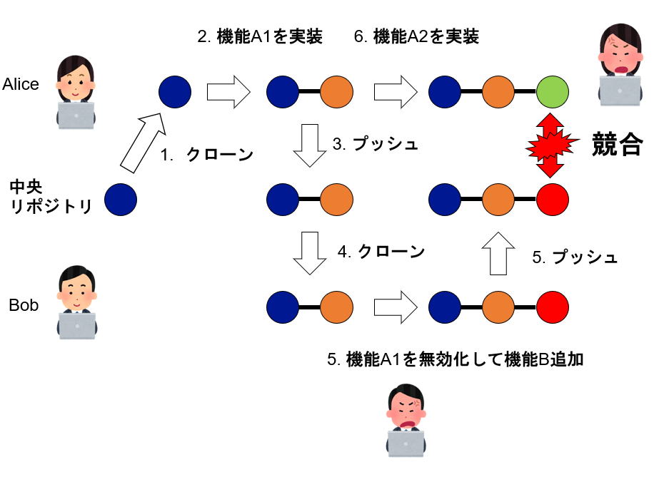

さて、AliceはA1まで実装し、区切りが良いのでそれをリポジトリにコミットした。そのタイミングでBobが機能Bを実装しようと、リポジトリからソース一式を取得(クローン)すると[^clone]、プログラムが正しく動作しない。やむを得ず、Bobは機能A1を無効化するコードを書いた上で機能Bを追加し、コミットした。その状態でAliceがサブモジュールA2を実装し、コミットしようとすると、リポジトリがBobによって修正されているから、マージをしようとする。しかし、Bobによって機能A1が無効化されている修正が入っていることに気づかず、A2を追加したのに機能Aが動かないことに悩むことになる。

[^clone]: クローンやプッシュについてはまだ説明していないが、とりあえずソース一式をダウンロード、アップロードすること、と思っておいて欲しい。

なぜこんなことが起きたのだろうか？複数人で同じソフトウェアを開発する以上、かならず競合(コンフリクト)は発生することになるが、上記の問題は「他の開発者が見る(クローンする)リポジトリに、中途半端な状態があった」ことに起因する。自分で開発している時、例えばビルドが通らない状態でも、一度家に帰るなどの理由でコミット、プッシュしたくなることはあるだろう。しかし、その状態を他の開発者がクローンすると、ビルドが通らないような状態のリポジトリに困ってしまう。そこで、「みんなが参照するブランチは、中途半端な状態にしない」というルールを作りたくなる。そのために利用するのがブランチだ。

Gitでは原則としてデフォルトブランチ(`main`)では作業せず、作業開始時にブランチを作成し、歴史を分岐させてから開発を進め、やろうと思った作業がまとまったところでデフォルトブランチにマージする、という開発体制をとる。どのようなブランチを、どのような時に作り、どのように運用するかを決めルールがワークフローだ。チームやプロジェクトに応じて様々なワークフローがあるが、ここでは最も簡単なフィーチャーブランチワークフローについて説明しよう。

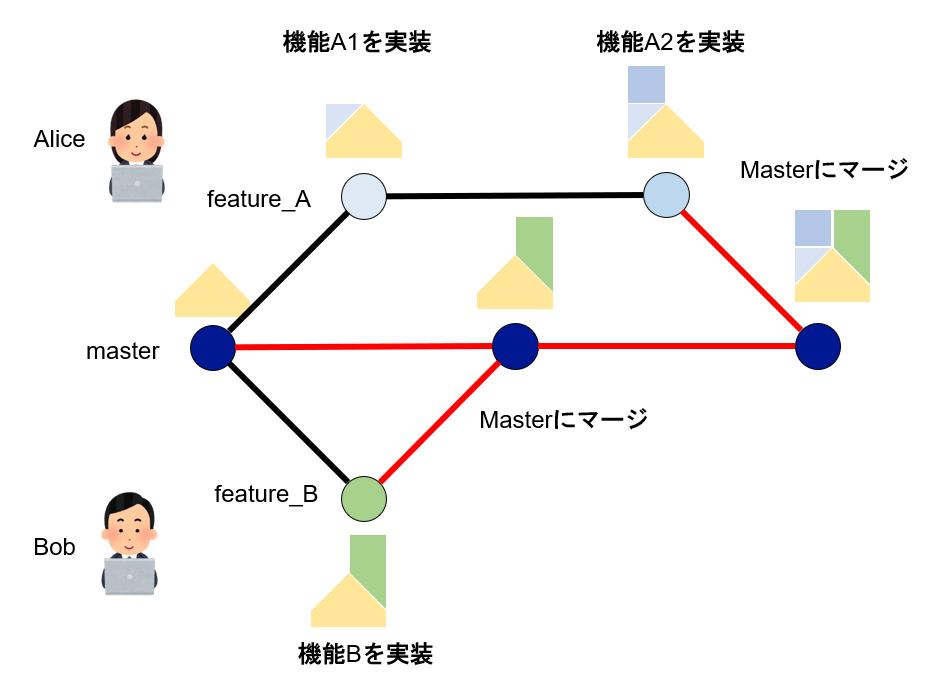

Aliceは機能Aを実装するため、`main`ブランチから`feature_A`ブランチを派生させる。そして、機能A1まで実装し、コミットした。この状態で先ほどと同様、Bobが機能Bの実装を開始したとしよう。Bobが見るのは`main`ブランチなので、そこに`feature_B`ブランチを派生させる。Bobは問題なく機能Bを実装し、`main`ブランチにマージする。その後、Aliceは機能A2まで実装を完了し、`main`にマージしようとすると、Bobにより機能Bが追加されているため、その修正を取り込まなければならない。しかし、特に機能Aと機能Bは競合していなかったため、両方の修正を問題なく取り込んで、`main`にマージして、無事に機能Aと機能Bが実装された。

追加したい機能ごとに派生したブランチを**フィーチャーブランチ(feature branch)** と呼ぶ。フィーチャーブランチを利用したワークフローをフィーチャーブランチワークフローと呼ぶ。フィーチャーブランチワークフローは、ワークフローのうち最も簡単なもののひとつだ。ここで、`main`ブランチの歴史がマージでしか増えていないことに注意したい。ほとんどのワークフローにおいて、`main`には直接コミットをせず、必ずブランチを経由する。ブランチでは中途半端な状態でコミットしても良いが、`main`には「きちんとした状態」にしてからマージする。これにより、`main`ブランチが常に「まとも」な状態であることが保証される。

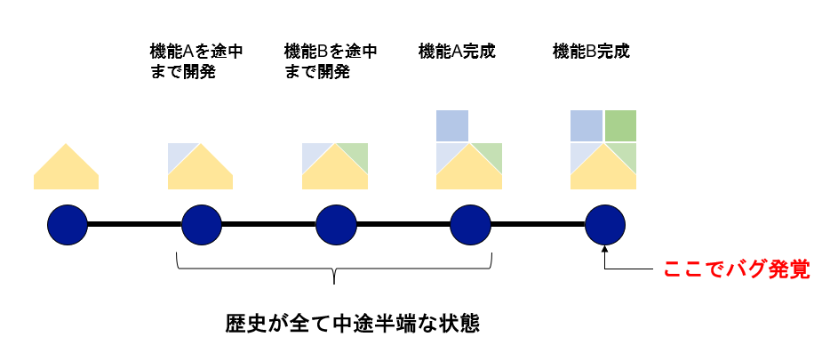

ワークフローはもともと多人数開発のために用意された開発ルールだが、一人で開発する場合も有用だ。例えば、卒論用のプログラムに、機能Aを追加することにした。機能Aを開発中に、機能Bも必要なことに気が付いたので、それも追加することにした。最終的に機能A、機能Bの両方を実装しおわった時に、プログラムがバグっていることに気が付いた。このように「まっすぐな一本の歴史」で開発をしていると、機能Aと機能Bをごっちゃに開発していた場合、開発の「歴史」が全て中途半端な状態となるため、そのバグがどちらの機能に起因するかわからなくなる。

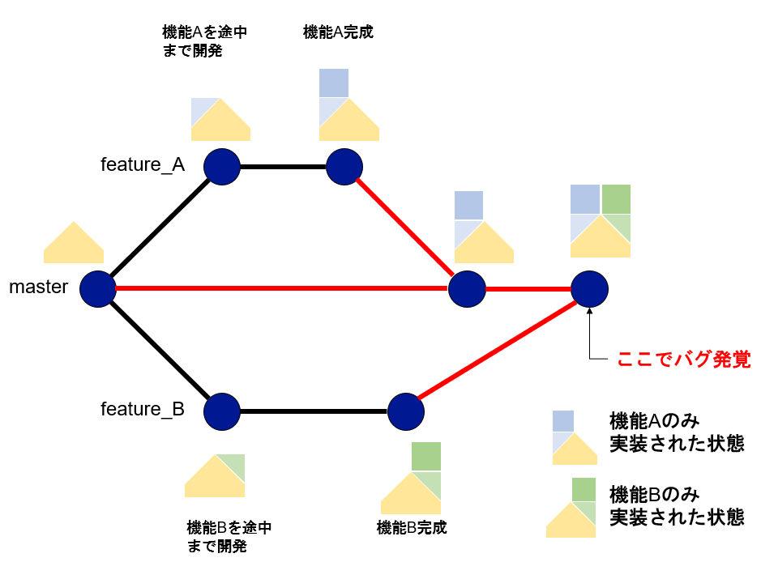

一方、もしあなたが普段から単独開発であっても「新機能は必ずブランチを派生させて開発する」というルールを守っていたとしよう。機能Aを追加するため、`feature_A`というブランチを作り、そこで途中まで開発を進めた。ここで「あ、機能Bも必要だな」と思ったあなたは、`main`ブランチに戻ってから`feature_B`ブランチを作成し、途中まで開発する。そこで「やっぱりAを完成させておくか」と思って、`feature_A`ブランチに戻って開発を進め、機能Aを完成させて`main`にマージする(fast-forwardマージになる)。次に、`feature_B`にブランチに移って、機能Bを最後まで完成させてから`main`にマージする。この時点でバグが発覚する。

開発の手間は「まっすぐな一本の歴史」とほとんど同じであり、最後のソフトウェアの状態も先ほどと同じだ。しかし、先ほどと異なり、過去の歴史には「機能Aのみ実装された状態」と「機能Bのみ実装された状態」が存在する。それぞれの状態を呼び出してテストしてみれば、どちらがバグの原因になっているかがすぐにわかる。「容疑者」が少ない分、デバッグ時間も短くなる。

これは筆者の経験から強く伝えたいことだが、「三日前の自分は他人」である。同様に「三日後の自分も他人」だ。他人と開発するのであるから、単独開発であっても多人数開発と同様な問題が発生する。一人で開発しているにも関わらず、いちいちブランチを切るなど面倒だと思うかもしれない。しかし、「ブランチを切ってマージする手間」に比べて、「何か問題が起きた時にブランチを切っていたことで軽減される手間」を比べると、後者の方が圧倒的にメリットが大きい。何より問題なのは、デバッグのために「全て中途半端な状態の歴史」と格闘している人が、「ブランチを切っていたらこの手間が軽減されていた」という可能性に気づかないことだ。Gitを使えば開発が便利になるのではなく、開発が便利になるようにGitを使うように心がけなければならない。

## ブランチの基本

### カレントブランチとコミット

まず、ブランチとコミットについておさらいしておこう。Gitが管理する歴史はコミットがつながったものであり、そのコミットにつけた「ラベル」がブランチだ。特に「いま自分が見ている」場所を指すブランチをカレントブランチと呼ぶ。どのブランチがカレントブランチかを示すのが「HEAD」である。また、コミットとは、新たにコミットを作り、今見ていたコミットにつなげる操作だが、「今見ていたコミット」とは、「HEADが指しているブランチが指しているコミット」のことだ。

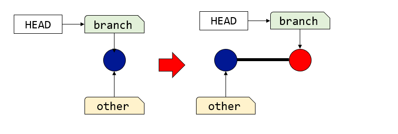

今、カレントブランチが`branch`だとしよう。カレントブランチとは、`HEAD`というラベルが指すブランチのことなので、`HEAD`は`branch`を指してしている。あるブランチ`branch`が、別のブランチ`other`と同じコミットを指していたとする。この状態でコミットをすると、新たにコミットが作られ、カレントブランチが指すコミットにつなげられることで歴史が伸びる。そして、カレントブランチは新たに作られたコミットを指す。具体的には、`HEAD`が`branch`を指したまま、`branch`が新たにできたコミットを差す。この時、カレントブランチ以外のブランチは移動しないことに注意。この状態でカレントブランチを`other`に変更してコミットをすると、歴史が分岐することになる。

### コミットと差分

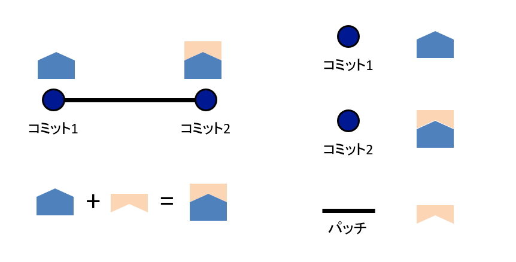

Gitのコミットは、自分の親コミットを覚えており、それをたどることで歴史をたどることができる。いま、コミット1からコミット2が作られたとする。コミット2にとってコミット1は親コミットになる。この時、それぞれのコミットはその時点でのスナップショットを表しているが、玉と玉をつなぐ線は差分(パッチ)を表している。玉と線からなる歴史は、一つ前の玉が表すコミットに、線が表すパッチを適用することで、次のコミットが得られる、と解釈することができる。この、**コミットの間の線は差分(パッチ)を表す** という事実は今後の説明に重要な役割を果たす。

### ブランチの作成と切り替え

ブランチは`git branch`で作ることができる。ブランチはコミットにつけるラベルであるから、任意のコミットを指定して作ることができる。

```sh
git branch ブランチ名 ブランチをつけたいコミット
```

ブランチをつけたいコミットは、コミットハッシュの他、別のブランチでも指定できる。

しかし、一番よく使われるのは、カレントブランチに別名を与えることだ。その場合は、`git branch`に与える第二引数は不要で、ブランチ名を指定すれば良い。

```sh
git branch newbranch
```

これにより、`newbranch`というブランチが作られ、カレントブランチが指しているコミットを指す。

この状態では、同じコミットに二つのブランチがついただけだ。この状態で、「今見ているブランチ」を`newbranch`に切り替えよう。ブランチの切り替えは`git switch`を使う。

```sh
git switch newbranch
```

これで、HEADが`main`から`newbranch`を指すようになった。この状態で何か修正してコミットをすると、HEADと`newbranch`は新しいコミットに移動するが、`main`は取り残される。つまり、新しいブランチを作成して切り替える作業は、作業前の状態がどのコミットであったかを保存しておく、という意味を持つ。

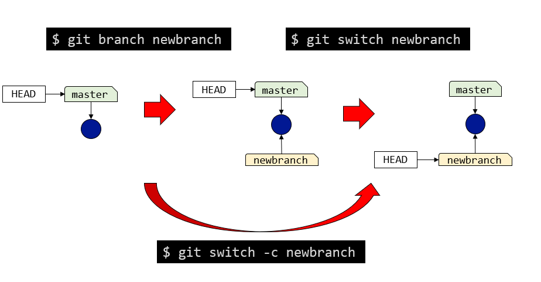

なお、`git switch`に`-c`オプションをつけると、ブランチの作成と切り替えを同時に行ってくれる。

```sh
git switch -c newbranch
```

これは以下のコマンドと等価だ。

```sh
git branch newbranch
git switch newbranch
```

通常の作業では`git switch -c`を使うことが多いだろう。

以上の操作をまとめて置こう。

* 「カレントブランチ」とはHEADが指すブランチである
* 「git branch ブランチ名」で、カレントブランチが指すコミットに別のブランチをつけることができる
* 「git switch ブランチ名」で、カレントブランチを変更できる(HEADを付け替えることができる)
* 「git switch -c ブランチ名」で、ブランチの作成とカレントブランチの変更を同時に行うことができる。

## マージ

### マージの使い方

Gitでの開発は原則として機能単位でブランチを作成し、その機能の実装が終わったらそれを`main`ブランチに取り込む。そのためのコマンドが`git merge`だ。

```sh
git merge ブランチ名
```

この時、「カレントブランチ」に、「ブランチ名」の修正を取り込むことに注意。多くの場合、`main`ブランチに修正を取り込むことになるだろう。マージ実行後、カレントブランチは最新のコミットを指すが、マージ元のブランチはそのままになる。

また、`git merge`でブランチ名を省略すると「上流ブランチ」をマージ元に指定したことになる(後述)。

マージとは、マージ対象となる二つのブランチの共通祖先を見つけ、そこからの修正を全て取り込んだ新たなコミットを作る作業だ。

今、`feature`ブランチで作業が終わったとしよう。個人開発の場合、ブランチで作業している間に`main`ブランチが修正されることは少ないであろう。その場合、`main`ブランチが`feature`ブランチの直接の祖先を指す。この時、共通祖先は`main`コミットが指すコミットそのものであり、そこからの修正を全て取り込んだスナップショットとは、いま`feature`ブランチが指しているコミットとなるから、この状態で`main`から`feature`に対して`merge`をすると、`main`ブランチが`feature`ブランチの指すコミットに移動するだけとなる。これがfast-forwardマージであった。

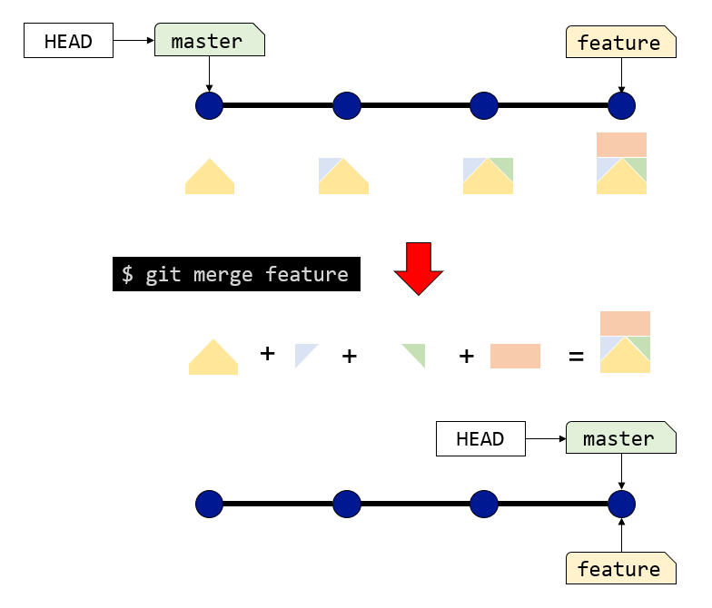

ここで、玉はスナップショットを、線はスナップショット間の差分(パッチ)を表現していることを思い出そう。マージとは、あくまで「差分を次々と適用していく」という作業だ。したがって、`main`から`feature`に対してマージをかけると、`main`ブランチが指すコミットに対して、`feature`ブランチが指すコミットに至るまで、差分を次々と適用する。その結果得られるスナップショットは、現在`feature`ブランチが指しているコミットと全く同じものになる。だから`main`ブランチの指す先を`feature`ブランチの指す先に移動するだけで良いよね、というのがfast-forwardマージのやっていることだ。

次に、歴史が分岐している場合のマージを考えよう。いま、`main`と`feature`で、それぞれ歴史が進んでいる。この状態で`main`から`feature`に対してマージをかけると、二つの歴史を一つにするような新たなコミット(マージコミット)を作る。

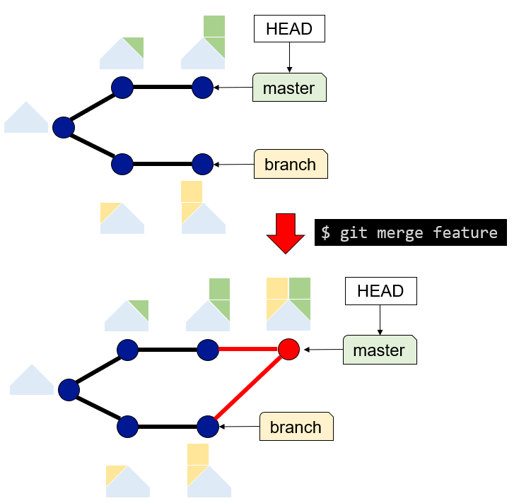

この時作られたマージコミットには親コミットが二つある。この時、それぞれの線は、それぞれの親からの差分を表している。

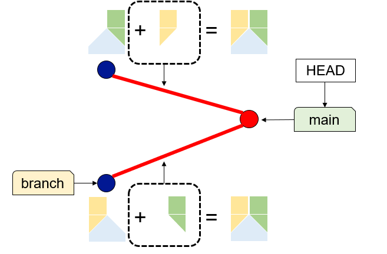

なお、`git merge`に`--no-ff`オプションを付けると、fast-forwardマージが可能な場合でもマージコミットを作る。

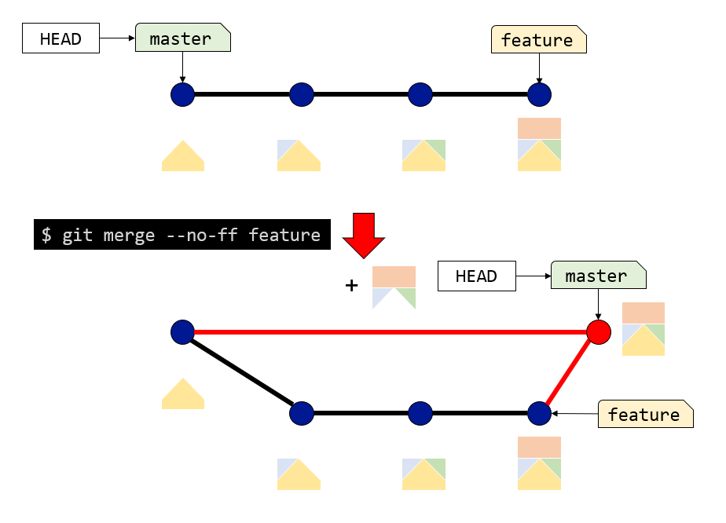

この場合、新たにコミットが作られ、`main`はそこに移動する。この時、新たに作られたコミットには二つの親コミットができる。一つはもともと`main`が指していたコミットで、そのコミットとの差分は`feature`ブランチに至るまでの差分を全てまとめたものとなっている。もう一つの親は`feature`が指しているコミットだが、スナップショットは同じなので差分はない。

### ブランチの削除

マージが終わり、不要となったブランチは`git branch -d ブランチ名`で削除できる。あくまでもラベルが削除されるだけであり、それが指していたコミットはそのまま残る。例えば、既にマージ済みの`feature`ブランチを削除した場合、そのブランチがどのコミットを指していたかが表示される。

```sh
$ git branch -d feature
Deleted branch feature (was 1c168e1).
```

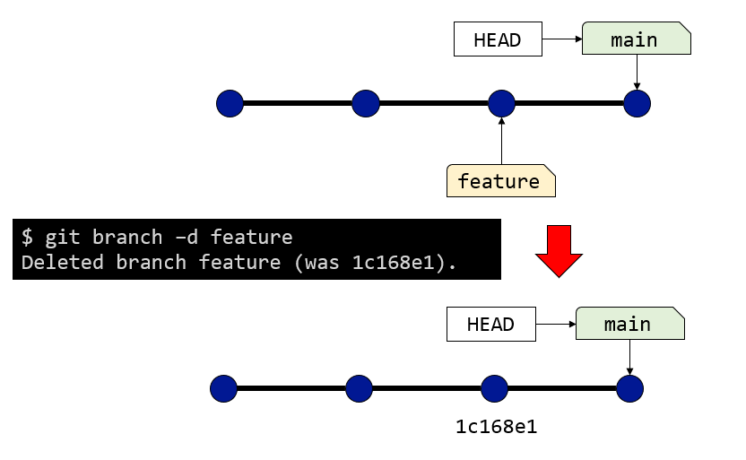

上記の例では、`feature`は`1c168e1`というコミットを指していた。ブランチを削除してもコミットが消えるわけではないので、このコミットハッシュを指定してまたブランチを付けたり、差分を表示するなどの作業ができる。

一方、ブランチがマージされていないコミットを指していた場合、そのブランチを削除してしまうと(コミットハッシュを覚えていない限り)そのコミットにアクセスする手段がなくなる。そのような場合にブランチを削除しようとすると、以下のようなエラーメッセージが表示される。

```sh
$ git branch -d branch
error: The branch 'branch' is not fully merged.
If you are sure you want to delete it, run 'git branch -D branch'.
```

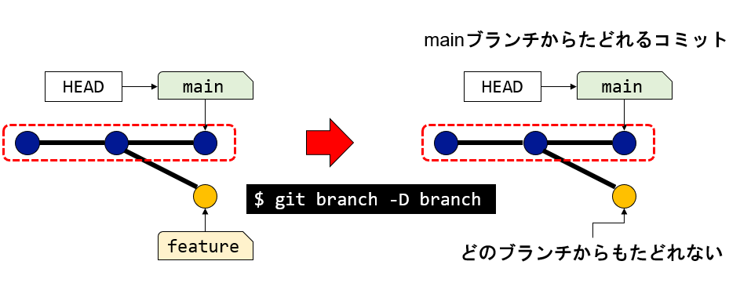

エラーメッセージにあるように、`git branch`に`-D`オプションを付けると無理やり消すことができる。

```sh
$ git branch -D branch
Deleted branch branch (was f59b8e4).
```

なお、このエラーが出る条件は、「カレントブランチからたどることができる歴史のコミットを指しているかどうか」である。したがって、以下のような歴史がある場合、カレントブランチが`main`の時には`old_branch`は`git branch -d`では消せないが、カレントブランチが`latest_branch`の場合は`old_branch`を消すことができる。

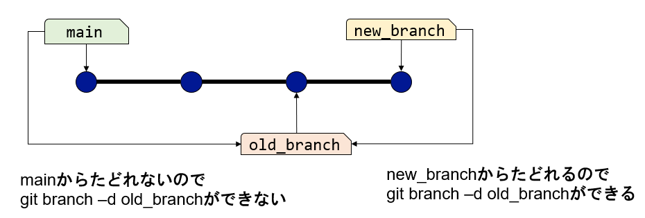

### 衝突(コンフリクト)

歴史が分岐している状態でマージすると、Gitは可能な限り、両方の修正を取り込んでマージしようとする。この時、異なる歴史で同じファイルを修正していた場合でも、それが異なる場所であると判断された場合は、両方の修正を取り込んだコミット(マージコミット)を作る。

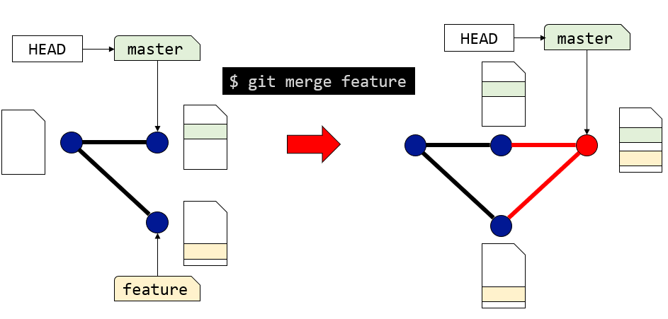

しかし、同じファイルの同じ場所が修正されていた場合、Gitはどのようにマージすれば良いかわからず、マージコミットを作ることができない。この状態を衝突、もしくは **コンフリクト(conflict)** と呼ぶ。

例えば、`main`と`feature`ブランチの両方で、同じファイル`test.txt`を修正していたとしよう。この状態で`main`から`feature`をマージしようとすると、Gitは衝突を検出し、ユーザに対応を求める。

```sh
$ git merge feature
Auto-merging test.txt
CONFLICT (content): Merge conflict in test.txt
Automatic merge failed; fix conflicts and then commit the result.
```

例えば`test.txt`は、以下のような状態になっている。

```tt
Hello Merge!

<<<<<<< HEAD
This line is modified on main.
=======
This line is modified on feature.
>>>>>>> feature
```

これは、カレントブランチ(HEAD)で、

```txt
This line is modified on main.
```

と修正した部分が、`feature`ブランチで

```txt
This line is modified on feature.
```

となっているよ、という意味だ。ユーザはこれを見て、両方の修正を取り込んだ状態にして`test.txt`を保存し、`git add`してから`git commit`する。

```sh
git add test.txt
git commit -m "merged feature"
```

複数のファイルが衝突していた場合も同様だ。衝突が起きた場合、自動でマージコミットを作れなかったのだから、手動でマージコミットを作る必要がある。`git add`を使ってインデックスにマージコミットのあるべき姿を作ったら、最後に`git commit`によりコミットする。すると、その時にインデックスにあった状態がマージコミットとなり、マージが完了する。

## リベース

### コミットをまとめるということ

機能を追加する際、とりあえずブランチを派生させ、そこで作業をする。この時、デバッグのために途中経過のようなコミットも作るであろう。それをそのままメインブランチにマージしてしまうと、中途半端な状態のコミットが歴史に残ることになる。

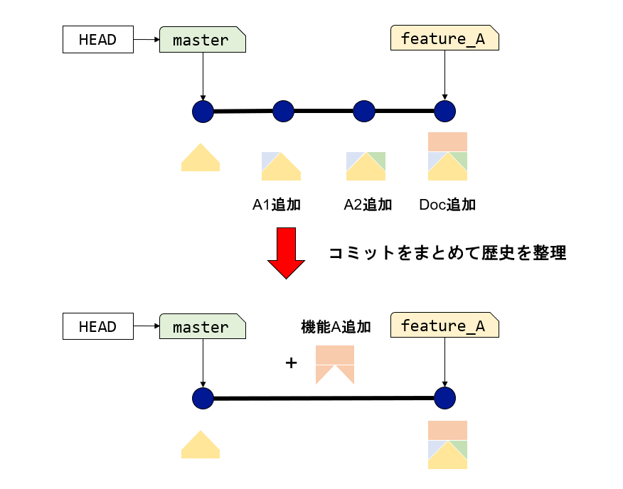

例えば、いま機能Aを追加するために、`feature_A`というブランチを作って作業をしたとしよう。機能Aの実装は「クライアント側のモジュール(A1)を作る」「サーバ側のモジュール(A2)を作る」「ドキュメント(Doc)を更新する」の三つのサブタスクからなる。担当者は、サブタスクが完了する度にコミットを作ったので、三つコミットができた。いま、`main`には歴史が追加されておらず、このままfast-forwardマージができる状況だ。

しかし、これらのサブタスクは、全体から見える必要はない。例えば「機能Aのクライアント側のモジュールA1だけができた状態」を後から参照する必要はない。むしろ、中途半端な状態が歴史に含まれていると、後でテストが失敗するなどして害悪だ(例えば、`git bisect`が問題を起こす)。そこで、これらのコミットをまとめて「機能Aを実装した」という情報だけをメインの歴史に追加したい、というニーズが出てくる。

Gitにおいて歴史は単なる記録ではなく、後で参照するためのものだ。記録を雑多な形で残しておくと後で苦労するので、なるべくきれいな形で整理しておきたい。Gitにはsそのためにコミットをまとめて綺麗な形にしてマージする方法がいくつか提供されている。一つは`merge --squash`だ。これは、マージしようとするブランチの修正を一つにまとめるものだが、ここでは詳細は触れない。

もう一つの方法がリベースである。ソフトウェアを開発する会社に入社した場合、おそらく「メインブランチにマージする前にリベースでコミットをきれいにしてからプルリクを作れ」などと言われるであろう。以下では、このリベースについて説明する。

### リベースで変わるもの、変わらないもの

先ほどマージで見た状況を考えよう。`main`と`branch`ブランチがあり、歴史が分岐している。この状態で`branch`ブランチから`main`にリベースをするには、カレントブランチが`branch`の状態で

```sh
git rebase main
```

を実行する。すると、二つのブランチの共通祖先のコミットから`branch`ブランチにつながるコミットが`main`の先に移動する。

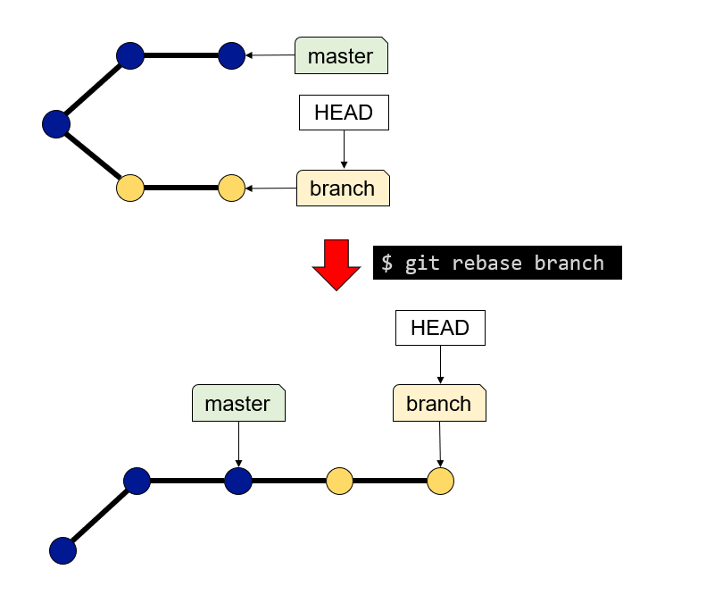

この図だけを見ると、まるでコミットが移動したように見えるが、実際には`branch`につながるコミットの間から「パッチ」を取り出し、それを順番に適用することで新たにコミットを作っている。

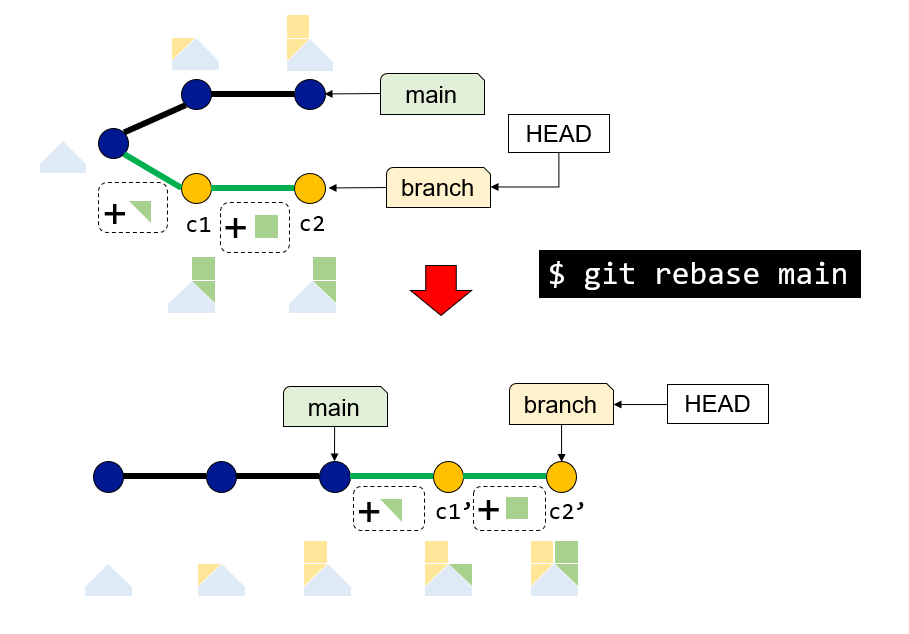

図を見れば、もともと`branch`にぶら下がっていたコミット`c1`,`c2`と、リベース後に`branch`にぶら下がる`c1'`、`c2'`は異なるスナップショットを表していることがわかるであろう。むしろ変わっていないのは`c1`や`c1'`から親コミットに向かって伸びる線が表すパッチであり、「リベースとは、玉(コミット)ではなく、線(パッチ)を移動する操作である」と理解できる。

### コミットのsquash

実際の運用では、`git rebase`をそのまま使うことより、`git rebase -i`で対話的に使うことが多いであろう。`git rebase`に`-i`オプションを付けると、移動する予定のそれぞれのコミットについてどうするかを聞かれる。

例えば、カレントブランチが`branch`である時に、

```sh
git rebase -i main
```

と`main`ブランチに対して対話的なリベースを実行すると、エディタが開き、以下のような画面が表示される。

```txt
pick d6f185f c1
pick b2b0b0b c2

# Rebase e9c8c91..b2b0b0b onto e9c8c91 (2 commands)
```

今回は、`main`と`branch`の共通祖先であるコミットから、`branch`が指すコミットまで、二つのコミットがあり、それらに対する対応を選ぶ。対応には様々なものがあるが、よく使うのは

* pick: そのままコミットを使う
* squash: コミットを使うが一つ前のコミットと融合する

であろう。デフォルトは`pick`であり、`-i`をつけずにリベースをした場合は、リベース対象となっている玉が全てリベース先にくっつくことになる。

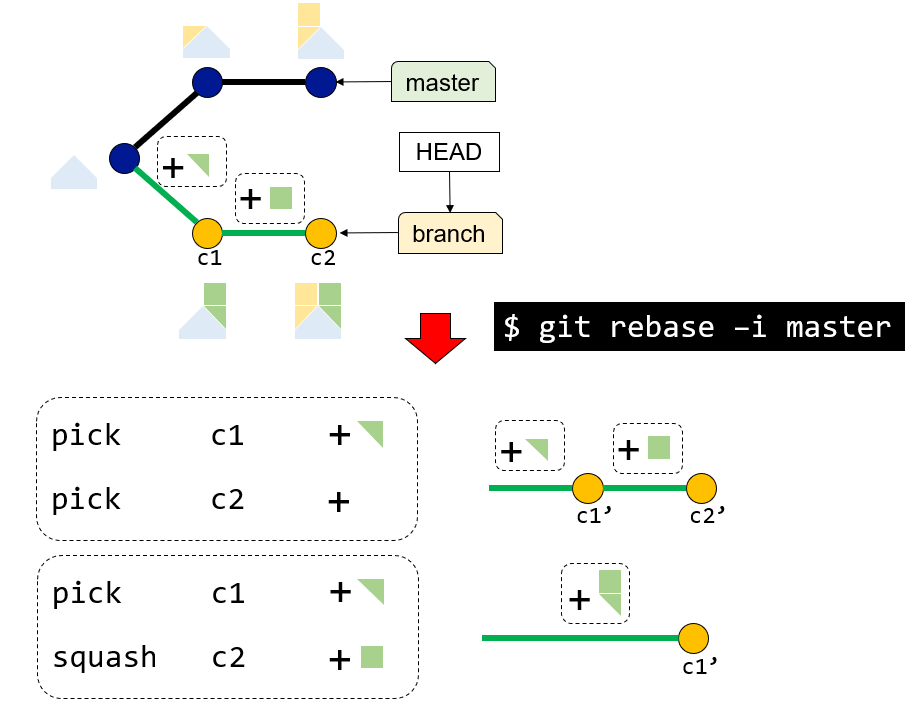

一方、`squash`を選ぶと、そのコミット(が表すパッチ)は採用するが、コミットとしては前のコミットにまとめられる。この場合も、「玉(コミット)をまとめる」というよりは、「線(パッチ)をまとめる」操作であることがわかる。また、コミットを使わずに消したり、コミットの順序を入れ替えることもできる。

### リベース中の衝突

マージが二つのブランチの修正を一度に取り込む作業であったのに対して、リベースはリベース先(多くは`main`であろう)に次々とパッチをあてていく作業だ。したがって、衝突が起きた時、マージなら衝突の解決を一度だけ行えば良かったのに対して、リベースは何度も衝突し、その度に解決する必要が出てくる。リベース中に何度も衝突が起きると慌てがちだが、頭の中で「リベース先に修正を適用することで新たなコミットを作っている」というイメージがあれば、どのような状態をインデックスに作れば良いかがわかるであろう。自分で「いまこの部分のコミットを作っている」とイメージし、インデックスにそのコミットがあるべき姿になるように修正、`git add`して、`git commit`した後、`git rebase --continue`によりリベース作業を再開すれば良い。

### リベースの使い道

マージが「`main`に`feature`ブランチの修正を取り込む」行為であるのに対して、リベースは「`feature`ブランチに、`main`ブランチに加えられた修正を取り込む」行為であることに注意したい。つまり、リベースは`main`ブランチに影響を与えず、`main`に修正を取り込むには、その後でマージする必要がある。したがって、リベースはマージの前に行う前処理である。

もともと`branch`は`main`ブランチから派生したものだが、開発中に`main`ブランチの歴史が進んでしまった。ここで`branch`から`main`にリベースすると、あたかも最新の`main`ブランチから`branch`の開発を進めていたかのような歴史を作ることができる。Gitが積極的に歴史を改変していることがわかるかと思う。これにより、`main`に修正を取り込む前に、自分が追加した修正が、`main`に加えられた変更により動作がおかしくなっていないかを確認することができる。最新の`main`の修正を取り込んだ上で、追加された機能が正しく動作すると確認したら、カレントブランチを`main`に変更してマージすれば良い。

リベースしても、`main`ブランチには影響を与えない。また、リベースすると`main`が直接の祖先になるが、その場合でも再度リベースできる。一般的には、何度もリベースして、望む歴史にしてからマージを行う。

ブランチの修正を取り込むのに、マージ派とリベース派があり、マージも`--squash`するかしないか、`--no-ff`するかしないかなどいろいろ流儀がある。それぞれメリット、デメリットがあるため一概にどれが良いとか悪いとかは言えないが、それらがどういう作業になっているのかは理解しておきたい。

## まとめ

Gitはブランチを利用して、積極的に歴史を改変する。個人開発の場合、ずっと`main`ブランチで作業しがちだが、個人的には機能ごとにブランチを切って作業し、マージする癖をつけた方が良いと思う。なぜならブランチを切ると「今自分がどんな作業をしようとしているのか」が明確になるからだ。作業が明確になれば、ゴールも明確になる。作業中に別の作業がやりたくなった場合は、別のブランチで作業をすべきだ。一度に複数の作業を同時に行うと、後で混乱し、後で大きく時間をロスしてしまう。「`main`ブランチに直接コミットしない」というルールを守るだけで、開発がスムーズになることであろう。

フィーチャーブランチを作って作業し、作業が一段落ついた時に、それを`main`にマージする時にリベースすべきかどうかは個人、もしくは所属チームのルールによる。ただし、慣れないうちはリベース中の衝突は混乱しがちなので、個人開発の場合はとりあえずリベースはせずマージだけで運用し、慣れてきたあたりでリベースを使ってみると良い。
