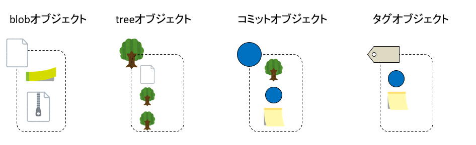
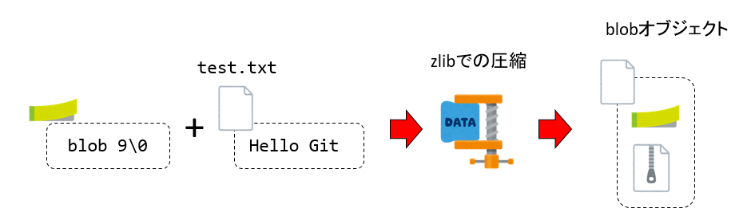
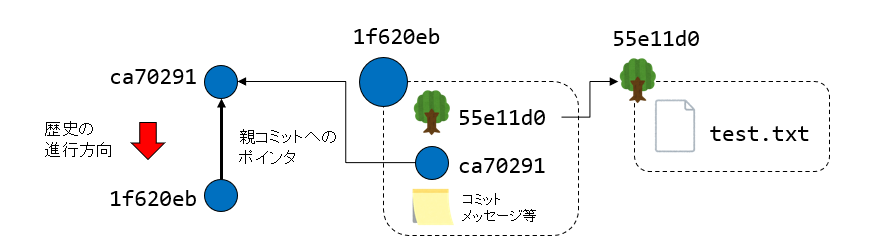
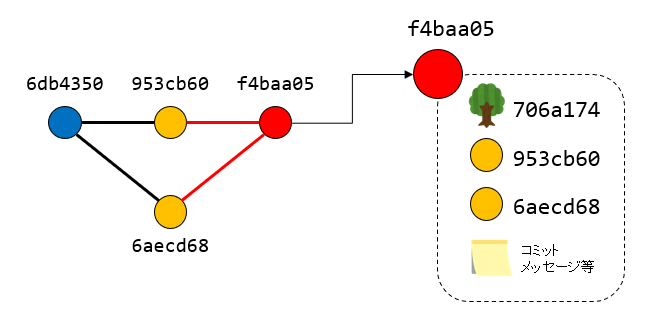
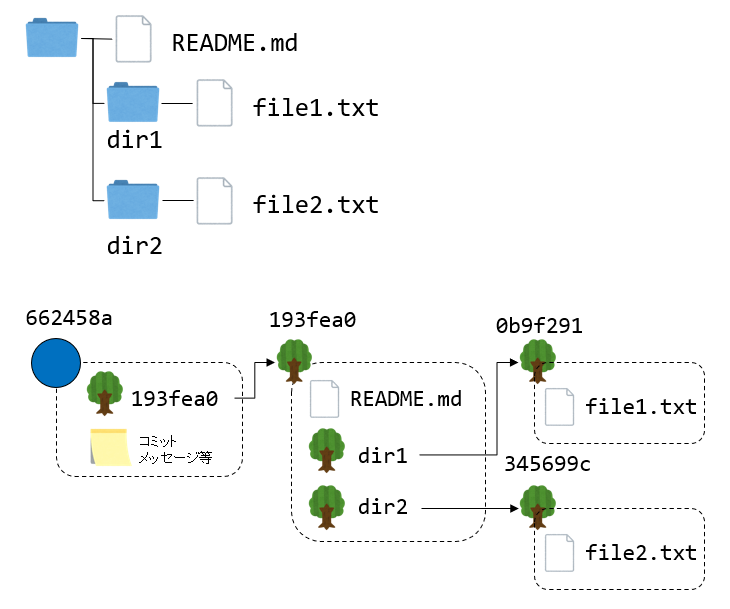
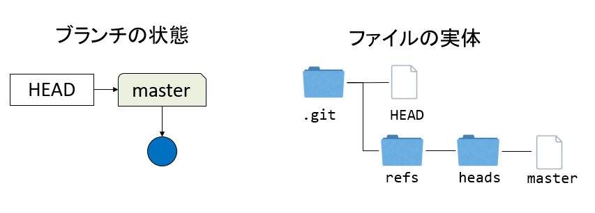
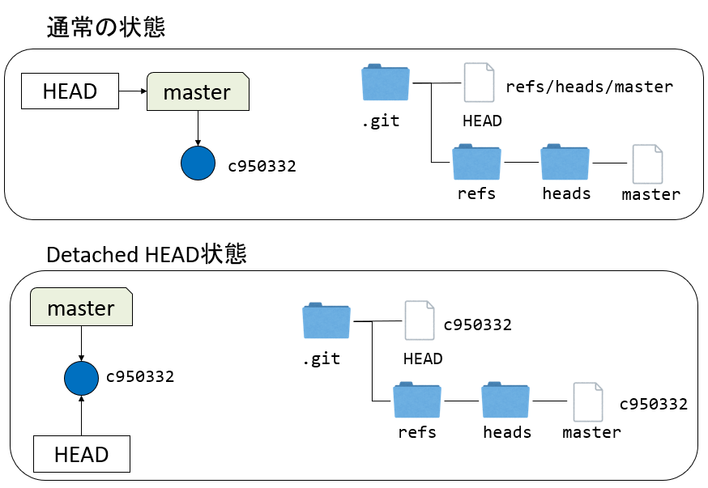

# Gitの仕組み

## はじめに

Gitで管理するプロジェクトには`.git`というディレクトリがあり、その中にGitの管理情報が入っている。その中には、全てのコミットや、いろんなバージョンのファイル、ブランチ、タグといった情報が格納されている。Gitを操作するにあたり、この中身がどうなっているかを理解する必要はないし、もし中身を覚えたとしても、操作方法は変わらないまま、内部実装だけ変更になる可能性もある。それでも、Gitの仕組み、特に様々な情報が`.git`にどのように格納されているかを知っておくのは二つの理由から有用だと考える。

一つ目の理由は、「物が動く仕組み」を知っておくことが教養だからだ。車を運転するのに、アクセルを踏めば進み、ブレーキを踏めば止まり、ハンドルを回せば曲がることを知っていれば十分だ。しかし、シリンダーにガソリンが噴射され、ピストンで圧縮したところで点火し、爆発する力でピストンが押される、という直線的な動きを作り、それを回転運動に変換してタイヤが回っている、ということくらいは(特に理工系の学生なら)ぼんやりとは知っておいて欲しい。さらに、その点火システム(イグニッションコイル)に電磁誘導が使われていると知れば、「なるほど、学校で習った電磁気の性質がこんなところに使われているのか」と思うことであろう。自分でゼロから作れるほど理解する必要はないが、物やツールをブラックボックスにせず、その中身をぼんやりとでも知っておくのは良いことだ。

もう一つの理由は、「機能は、なんらかの方法で実装されている」という感覚を持って欲しいためだ。我々がツールに求めるのは「機能」であるが、同じ機能であっても複数の実現手段がある。例えば、電子レンジとオーブンは、「どちらも食品を加熱する」という機能を持っているが、その実現方法は異なる。同様に、GitもSubversionはどちらもバージョン管理システムであり、どちらにもブランチやタグという概念があるが、その実装方法は全く異なる。Gitはツールである。ツールであるからには何らかの機能を提供している。その機能、例えばコミットによるスナップショットの保存や、ブランチの切り替えなどが、実際にはどのように実現されているかを見てみるのは無駄にはならないであろう。

以下では、Gitの実装、特に`.git`ディレクトリの中に何がどのように格納されているか紹介する。その詳細を覚える必要は全くない。しかし、「機能の実現には実装が伴う」ということ、また、Gitの実装が非常に素直であることを実感して欲しい。

## `.git`ディレクトリの中身

まず、`.git`の中身を見てみよう。適当なリポジトリで`ls .git`してみる。

```sh
$ ls .git
COMMIT_EDITMSG  HEAD       branches/  description  index  logs/     packed-refs
FETCH_HEAD      ORIG_HEAD  config     hooks/       info/  objects/  refs/
```

表示されるファイルはリポジトリの状態によって異なるが、概ね上記のようなファイルやディレクトリが含まれている。このうち、主なものを紹介する。

* `HEAD` - カレントブランチ(HEAD)の情報を保存するファイル
* `index` - インデックスの情報を保存するファイル
* `config` - リモートブランチや上流ブランチ等の情報を保存するファイル
* `refs` - ブランチの情報を保存するディレクトリ
* `objects` - コミットなどのオブジェクトを保存するディレクトリ

以下、これらの「中身」について触れてみよう。

## Gitのオブジェクト

まずは、`.git/objects`の中身を見てみよう。ここにはGitが管理する「オブジェクト」が格納されている。Gitのオブジェクトには、以下の4種類がある。



* blobオブジェクト： ファイルを圧縮したもの。ファイルシステムの「ファイル」に対応
* treeオブジェクト： Blobオブジェクトや別のTreeオブジェクトを管理する。ファイルシステムの「ディレクトリ」に対応
* コミットオブジェクト： Treeオブジェクトを包んだもの。コミットのスナップショットに対応するTreeオブジェクトに、親コミット、コミットメッセージなどを付加する
* タグオブジェクト： 他のGitオブジェクトを包んだもの。ほとんどの場合はコミットオブジェクトを包むが、TagのメッセージやTagをつけた人の情報などを付加する

この講義ではタグについては扱わないので、残りの三つ、blobオブジェクト、treeオブジェクト、コミットオブジェクトについて見てみよう。

### blobオブジェクト



blob[^blob]オブジェクトは、ファイルを保存するためのオブジェクトだ。その実体は、ファイルに`blob`というテキストと、ファイルサイズをヘッダ情報として付加し、zlibで圧縮したものだ。

[^blob]: blobは[Binary Large OBjectsの略](https://docs.github.com/en/rest/reference/git#blobs)らしい。

blobオブジェクトを実際に作ってみよう。適当なディレクトリで`git init`してから、適当なファイルを作る。

```sh
mkdir blob
cd blob
git init
echo -n "Hello Git" > test.txt
```

改行が含まれないように、echoに-nオプションをつけている。これをgit addすると対応するblobオブジェクトが作られる。

```sh
git add test.txt
```

この時点で、`e51ca0d0b8c5b6e02473228bbf876ba000932e96`というblobオブジェクトが作られた。見てみよう。

```sh
$ git cat-file -t e51ca0d0b8c5b6e02473228bbf876ba000932e96
blob

$ git cat-file -p e51ca0d0b8c5b6e02473228bbf876ba000932e96
Hello Git
```

`git cat-file`はオブジェクトのハッシュを指定して中身を見るためのコマンドだ。`-t`はそのオブジェクトのタイプを、`-p`は中身を表示する。`e51ca0d...`というオブジェクトはblobオブジェクトであり、中身は「Hello Git」というテキストファイルであることがわかる

この`e51ca0d...`というオブジェクトの実体は、`.git/objects`の中にファイルとして格納されている。

```sh
$ ls -1 .git/objects/*/*
.git/objects/e5/1ca0d0b8c5b6e02473228bbf876ba000932e96
```

Gitはオブジェクトのファイル名の頭二文字をディレクトリにして、残りをその下のファイルとして保存する。したがって、`e51ca0d...`というオブジェクトは、`.git/objects`以下の`e5`ディレクトリの下に、`1ca0d...`というファイル名で保存される。

このblobオブジェクトのファイル名は、対象となるファイルの頭にblob ファイルサイズ\0をつけたもののSHA-1ハッシュ値だ。ハッシュ値とは、ハッシュ関数にデータを入力した時の出力であり、ハッシュ関数とは、任意の長さのデータから、(多くの場合)固定長の長さの値を得るための操作のことだ。SHAは「Secure Hash Algorithm」の略であり、SHA-1(シャーワン)はSHAシリーズのうちの一つである。

ハッシュとは、以下のような性質を持つものだ。

* 任意の長さのデータを受け取り、固定の長さの出力(ハッシュ値)を返す
* 入力からハッシュ値を得るのは容易だが、あるハッシュ値を出力するような入力を探すのは極めて困難
* 入力が少しでも変化すると、ハッシュ値が大きく変化する

特に二番目の性質を「強衝突耐性」と呼ぶ。例えばメッセージとハッシュ値を両方展開した時、もしメッセージが改変されていればハッシュ値が変わるから改竄がバレる。しかし、同じハッシュ値を持つ別の入力を作ることができれば、データを改竄してもバレない。

SHA-1の強衝突耐性は既に突破されているため、セキュリティ用途には向かないが、残りの二つの性質が便利であるため、GitではオブジェクトのIDとしてSHA-1ハッシュを用いている。SHA-1は任意の入力に対して160ビットの出力を返す。16進数は0からFまでの16種類の数値で表現され、1桁が4ビットであるから、160ビットを16進数表記すると40桁となる。これがGitのコミットハッシュが0からFまでの16種類の文字を使って40桁となる理由だ。Gitではハッシュ値を全桁指定する必要はなく、他と区別が付く長さだけ指定すれば良い。通常、先頭7桁も取れば十分なので、`git log --oneline`などでは7桁だけ表示される。

さて、このハッシュ値を実際に作ってみよう。そのためには、`test.txt`の冒頭に`blob 9\0`というヘッダを付けた内容のSHA-1ハッシュ値を求めればよい。なお、`blob 9\0`の`blob`はblobオブジェクトであること、`9`はファイルサイズ、`\0`はヌル文字と呼ばれ、ヘッダと中身の境界を表現している。SHA-1ハッシュを得るには`shasum`を用いる。

```sh
$ { echo -en 'blob 9\0';cat test.txt;} | shasum
e51ca0d0b8c5b6e02473228bbf876ba000932e96 *-
```

確かに`e51ca0d`というコミットハッシュが得られた。なお、Gitにはヘッダを付けてハッシュを得るコマンド`git hash-object`が用意されている。

```sh
$ git hash-object test.txt
e51ca0d0b8c5b6e02473228bbf876ba000932e96
```

同じハッシュ値が得られた。`git cat-file`や`git hash-object`という、普段使わないが、普段使うコマンドの裏で実行されている低レベルなコマンドを **配管コマンド(plumbing commands)** と呼ぶ。一方、普段我々が使う`git add`や`git commit`などのコマンドを **磁器コマンド (porcelain commands)** と呼ぶ。これは、磁器とはトイレの便器のことで、Gitをトイレだと思った時、我々が普段使うコマンドが外に出ている便器、普段見ることのない低レベルなコマンドを下水などの配管にたとえたものだ。

細かいことはともかく、「Gitで良く出てくる英数字のIDはSHA-1ハッシュである」とだけ覚えておくと良い。

さて、ファイル名はSHA-1ハッシュであった。中身はファイルをヘッダ込みでzlibで圧縮したものだ。例えばPythonで実装するなこんな感じになる。

```py
import zlib
content = "Hello Git" # ファイルの中身

# ヘッダ付与
store = f"blob {len(content)}\0{content}".encode("utf-8")

data = zlib.compress(store) # 圧縮
print(bytes.hex(data))      # 中身の表示
```

`Hello Git`という中身を持つファイルに、`blob 9\0`というヘッダを付与して、`zlib.compress`で圧縮したバイト列を表示するスクリプトだ。実行してみよう。

```sh
$ python3 test.py
789c4bcac94f52b064f048cdc9c95770cf2c01002b750531
```

先ほど作成したblobオブジェクトの中身もダンプしてみよう。

```sh
$ od -tx1 .git/objects/e5/1ca0d0b8c5b6e02473228bbf876ba000932e96
0000000 78 01 4b ca c9 4f 52 b0 64 f0 48 cd c9 c9 57 70
0000020 cf 2c 01 00 2b 75 05 31
0000030
```

完全に一致していることがわかると思う。

まとめると、

* Gitのblobオブジェクトはファイルに対応している
* blobオブジェクトは対象ファイルにヘッダを付与したものであり、ファイル名はSHA-1ハッシュ値、ファイルの中身はzlibで圧縮したもの

である。以外に単純であることが実感できたであろうか？

### コミットオブジェクト

コミットオブジェクトは、コミット、すなわちスナップショットを保存するためのものだ。先ほど、`git add`した状態で止めていたのを、コミットしてみよう。

```sh
$ git commit -m "initial commit"
[main (root-commit) ca70291] initial commit
 1 file changed, 1 insertion(+)
 create mode 100644 test.txt
 ```

コミットハッシュ`ca70291`を持つコミットが作られた。これに対応するオブジェクトがコミットオブジェクトだ。いま、オブジェクトが何個できたか見てみよう。

```sh
$ ls -1 .git/objects/*/*
.git/objects/ca/70291031230dde40264d62b6e8d2424e2c9366
.git/objects/dd/1d7ee1e23a241a3597a0d0be5139a997fc29c8
.git/objects/e5/1ca0d0b8c5b6e02473228bbf876ba000932e96
```

`.git/objects`以下に3つオブジェクトができている。このうち、`e51ca0d`は`test.txt`に対応するblobオブジェクト、`ca70291`は今作ったコミットオブジェクト、もう一つの`dd1d7ee`は後述するtreeオブジェクトであり、コミットが保持するスナップショットを表現する
。blobオブジェクトやtreeオブジェクトは、同じ中身であれば同じハッシュ値を持つ。一方、コミットオブジェクトのハッシュはぶつかっては困るので、毎回異なるものになる。

さっき作ったコミットオブジェクト`ca70291`のタイプを見てみよう。。ちなみに、先ほど述べたように、ハッシュ値は他と区別が付けば40桁全てを指定する必要はない。

```sh
$ git cat-file -t ca70291
commit
```

確かにコミットオブジェクトになっている。この表示から`ca70291`はコミットオブジェクトであることがわかる。コミットオブジェクトは、以下の情報をまとめたものだ。

* スナップショットを保存するtreeオブジェクト
* 親コミットのコミットハッシュ
    * root-commitなら親コミット情報なし
    * merge commitなら親コミット情報二つ
* コミットの作成者情報
* コミットメッセージ

中身を見てみよう。

```sh
$ git cat-file -p ca70291
tree dd1d7ee1e23a241a3597a0d0be5139a997fc29c8
author H. Watanabe <kaityo256@example.com> 1632060650 +0900
committer H. Watanabe <kaityo256@example.com> 1632060650 +0900

initial commit
```

`dd1d7ee`というtreeオブジェクト、作成者、コミットメッセージを含んでいることがわかる。なお、これはroot commitなので、親コミットの情報は持っていない。適当に修正してコミットしてみよう。

```sh
$ echo "Hello commit object" >> test.txt
$ git commit -am "update"
[main 1f620eb] update
 1 file changed, 1 insertion(+), 1 deletion(-)
```

新しく`1f620eb`というコミットができた。中身を見てみよう。

```sh
$ git cat-file -p 1f620eb
tree 55e11d02569af14b5d29fe56fd44c1cc32c55e72
parent ca70291031230dde40264d62b6e8d2424e2c9366
author H. Watanabe <kaityo256@example.com> 1630738892  +0900
committer H. Watanabe <kaityo256@example.com> 1630738892 +0900


update
```



スナップショットを表すtreeオブジェクトが`dd1d7ee`から`55e11d0`に更新され、新たに親コミットとして、先ほどの`ca70291`が保存されている。

マージにより作られたマージコミットの場合は、二つの親コミットの情報を含んでいる。いま、こんな歴史を持つリポジトリを考えよう。

```sh
$ git log --graph --pretty=oneline
*   f4baa057ce89467a2faced36229da02799c9e394 (HEAD -> main) Merge branch 'branch'
|\
| * 6aecd68aa423651edda9d22e20925314ff3e8386 (branch) update
* | 953cb6056e5f0437f0d4e102f232d8eb705f6428 adds test2.txt
|/
* 6db4350c6ebd75338ac4bc2eb2a2924895a0c73b initial commit
```

root commitである`6db4350`から`6aecd68`と`953cb60`が分岐し、マージされて`f4baa05`になっている。



この最後のマージコミットf4baa05の中身を見てみよう。

```sh
$ git cat-file -p f4baa05
tree 706a1741c1d94977ba496449d80ab848ca945e14
parent 953cb6056e5f0437f0d4e102f232d8eb705f6428
parent 6aecd68aa423651edda9d22e20925314ff3e8386
author H. Watanabe <kaityo256@example.com> 1630743012 +0900
committer H. Watanabe <kaityo256@example.com> 1630743012 +0900

Merge branch 'branch'
```

スナップショットを保存するtreeオブジェクト`706a174`の他に、二つの親コミット`953cb60`と`6aecd68`が保存されていることがわかる。

### treeオブジェクト

treeオブジェクトは、ディレクトリに対応するオブジェクトだ。先ほどのblobオブジェクトの作り方を見てわかるように、blobオブジェクトはファイル名を保存していない。blobオブジェクトとファイル名を対応させるのもtreeオブジェクトの役目だ。また、コミットオブジェクトが格納するのは、スナップショット全体を表現するtreeオブジェクトである。

treeオブジェクトがディレクトリに対応することを見るため、適当にディレクトリを含むリポジトリを作ってみよう。

```sh
mkdir tree
cd tree
git init
mkdir dir1 dir2
echo "file1" > dir1/file1.txt
echo "file2" > dir2/file2.txt
echo "README" > README.md
git add README.md dir1 dir2
```

コミットしてみる。

```sh
$ git commit -m "initial commit"
[main (root-commit) 662458a] initial commit
 3 files changed, 3 insertions(+)
 create mode 100644 README.md
 create mode 100644 dir1/file1.txt
 create mode 100644 dir2/file2.txt
```

これで、コミットオブジェクト(`662458a`)が作られた。中身を見てみよう。

```sh
$ git cat-file -p 662458a
tree 193fea0500b331a7ccb536aa691d8eb7df8afd13
author H. Watanabe <kaityo256@example.com> 1630737694 +0900
committer H. Watanabe <kaityo256@example.com> 1630737694 +0900

initial commit
```

treeオブジェクトとコミットメッセージ等の情報を含んでいることがわかる。root commitなので、親コミットの情報はない。同じ手順を踏めば、コミットハッシュは異なっても、同じtreeオブジェクトができているはずだ。treeオブジェクト`193fea0`は、このコミットのスナップショットを保存している。見てみよう。

```sh
$ git cat-file -p 193fea0
100644 blob e845566c06f9bf557d35e8292c37cf05d97a9769    README.md
040000 tree 0b9f291245f6c596fd30bee925fe94fe0cbadd60    dir1
040000 tree 345699cffb47ac20257e0ce4cebcbfc4b2a7f9e3    dir2
```

ファイル`README.md`に対応する`blob`オブジェクトと、ディレクトリ`dir1`、`dir2`に対応するtreeオブジェクトが含まれている。二つのtreeオブジェクトも見てみよう。

```sh
$ git cat-file -p 0b9f291
100644 blob e2129701f1a4d54dc44f03c93bca0a2aec7c5449    file1.txt
$ git cat-file -p 345699c
100644 blob 6c493ff740f9380390d5c9ddef4af18697ac9375    file2.txt
```

ファイル構造とオブジェクトの構造を図示すると以下のようになる。



さて、blobオブジェクトやtreeオブジェクトにはファイル名、ディレクトリ名は含まれておらず、treeオブジェクトは、自分が管理するオブジェクトと名前の対応を管理している。

また、blobオブジェクトのハッシュは、ファイルサイズと中身だけで決まり、ファイル名は関係ない。したがって、Gitは「同じ中身だけど、異なるファイル名」を、同じblobオブジェクトで管理する。これを確認してみよう。

```sh
mkdir synonym
cd synonym
git init
echo "Hello" > file1.txt
cp file1.txt file2.txt
git add file1.txt file2.txt
```

これで、中身が同じファイル`file1.txt`、`file2.txt`がステージングされた。コミットしてみる。

```sh
$ git commit -m "initial commit"
[main (root-commit) 75470e6] initial commit
 2 files changed, 2 insertions(+)
 create mode 100644 file1.txt
 create mode 100644 file2.txt
```

コミットオブジェクト`75470e6`ができたので、中身を見てみよう。

```sh
$ git cat-file -p 75470e6
tree e79a5d99a8e5cd5da0260866b85df60052fd045e
author H. Watanabe <kaityo256@example.com> 1630745015 +0900
committer H. Watanabe <kaityo256@example.com> 1630745015 +0900

initial commit
```

treeオブジェクト`e79a5d9`ができている。中身を見てみよう。

```sh
$ git cat-file -p e79a5d9
100644 blob e965047ad7c57865823c7d992b1d046ea66edf78    file1.txt
100644 blob e965047ad7c57865823c7d992b1d046ea66edf78    file2.txt
```

全く同じblobオブジェクトに別名を与えていることがわかる。

## Gitの参照

Gitオブジェクトの次は、Gitの参照を見てみよう。参照はブランチやタグなどで`.git/refs`以下に格納されている。

### HEADとブランチの実体



通常、GitではHEADがブランチを、ブランチがコミットを指している。`HEAD`の実体は`.git/HEAD`というファイルだ。ブランチは`git/refs`にブランチ名と同名のファイルとして保存されている。例えば`main`ブランチの実体は`.git/refs/heads/main`というファイルだ。この関係を見てみよう。

適当なディレクトリ`test`を作って、その中で`git init`する。

```sh
mkdir test
cd test
git init
```

この時点で`.git`が作られ、その中に`HEAD`が作られた。ファイルの中身を見てみよう。

```sh
$ cat .git/HEAD
ref: refs/heads/main
```

この`ref: refs/heads/main`は、「`HEAD`は今`refs/heads/main`を指しているよ」という意味だ。しかし、`git init`直後はまだこのファイルは存在しない。

```sh
$ cat .git/refs/heads/main
cat: .git/refs/heads/main: そのようなファイルやディレクトリはありません
```

さて、適当なファイルを作って、`git add`、`git commit`してみよう。

```sh
$ echo "Hello" > hello.txt
$ git add hello.txt
$ git commit -m "initial commit"
[main (root-commit) c950332] initial commit
 1 file changed, 1 insertion(+)
 create mode 100644 hello.txt
```

初めて`git commit`した時点で、`main`ブランチの実体が作られる。

```sh
$ cat .git/refs/heads/main
c9503326279796b24be86bdf9beb01c1af2d2b95
```

`main`ブランチの実体である`main`というファイルには、コミットオブジェクトのハッシュが入っている。今回のケースでは、先ほど作られたコミットオブジェクト`c950332`が保存されている。このように、通常は`HEAD`はブランチのファイルの場所を指し、ブランチのファイルはコミットオブジェクトのハッシュを保存している。`git log`で見てみよう。

```sh
$ git log --oneline
c950332 (HEAD -> main) initial commit
```

`HEAD -> main`と、`HEAD`が`main`を指していることが明示されている。

### Detached HEAD状態

さて、直接コミットハッシュを指定して`git checkout`してみよう。

```sh
$ git checkout c950332
Note: switching to 'c950332'.

You are in 'detached HEAD' state. You can look around, make experimental
changes and commit them, and you can discard any commits you make in this
state without impacting any branches by switching back to a branch.

If you want to create a new branch to retain commits you create, you may
do so (now or later) by using -c with the switch command. Example:

  git switch -c <new-branch-name>

Or undo this operation with:

  git switch -

Turn off this advice by setting config variable advice.detachedHead to false

HEAD is now at c950332 initial commit
```

これで、`HEAD`がブランチを介してではなく、直接コミットを指している状態、いわゆる頭が取れた(`detached HEAD`)状態になった。この状態で`git log`を見てみる。

```sh
$ git log --oneline
c950332 (HEAD, main) initial commit
```

先ほどと異なり、`HEAD`と`main`の間の矢印が消えた。`HEAD`ファイルの中身を見てみよう。

```sh
$ cat .git/HEAD
c9503326279796b24be86bdf9beb01c1af2d2b95
```

先ほどは`ref: refs/heads/main`と、`main`ブランチの実体ファイルへのパスが格納されていたが、今は`HEAD`が直接コミットを指していることを反映して、そのコミットハッシュが保存されている。



`main`ブランチに戻ろう。

```sh
$ git switch main
$ cat .git/HEAD
ref: refs/heads/main
```

`.git/HEAD`の中身がブランチへの参照に戻っている。

### ブランチの作成と削除

`main`ブランチから、もう一つブランチを生やしてみよう。

```sh
git switch -c branch
```

これで、`branch`ブランチが作られ、`main`の指すコミットと同じコミットを指しているはずだ。まずは`git log`で見てみよう。

```sh
$ git log --oneline
c950332 (HEAD -> branch, main) initial commit
```

`HEAD`は`branch`を指し、`branch`も`main`も`c950332`を指している状態になっている。ファイルの中身も確認しよう。

```sh
$ cat .git/HEAD
ref: refs/heads/branch

$ cat .git/refs/heads/main
c9503326279796b24be86bdf9beb01c1af2d2b95

$ cat .git/refs/heads/branch
c9503326279796b24be86bdf9beb01c1af2d2b95
```

`.git/refs/heads/main`と同じ内容の`.git/refs/heads/branch`が作成されている。

ここで、人為的に`.git/refs/heads/`にもう一つファイルを作ってみよう。

```sh
$ cp .git/refs/heads/main .git/refs/heads/branch2
$ ls .git/refs/heads
branch  branch2  main
```

`.git/refs/heads`内に、`branch2`というファイルが作成された。`git log`を見てみると、

```sh
$ git log --oneline
c950332 (HEAD -> branch, main, branch2) initial commit
```

`branch2`が増え、`main`や`branch`と同じコミットを指していることが表示された。すなわち、`git`は`git log`が叩かれた時、全てのブランチがどのコミットを指しているか調べていることがわある。また、ブランチの作成が、単にファイルのコピーで実装されていることもわかった。

作った`branch2`をgitを使って消してみよう。

```sh
$ git branch -d branch2
Deleted branch branch2 (was c950332).

$ ls .git/refs/heads
branch  main
```

問題なく消せた。`.git/refs/heads`にあったブランチの実体も消えた。つまり、ブランチの削除は単にファイルの削除として実装されている。

### リモートブランチと上流ブランチ

リモートブランチも、普通にブランチと同じようにファイルで実装されている。まずは一つ上のディレクトリにリモートブランチ用のベアリポジトリを作ろう。

```sh
git init --bare ../test.git
```

ベアリポジトリは、`.git`の中身がそのままディレクトリに展開された内容になっている。

```sh
$ tree ../test.git
../test.git
├── HEAD
├── branches
├── config
├── description
├── hooks
│   ├── applypatch-msg.sample
│   ├── commit-msg.sample
│   ├── fsmonitor-watchman.sample
│   ├── post-update.sample
│   ├── pre-applypatch.sample
│   ├── pre-commit.sample
│   ├── pre-merge-commit.sample
│   ├── pre-push.sample
│   ├── pre-rebase.sample
│   ├── pre-receive.sample
│   ├── prepare-commit-msg.sample
│   └── update.sample
├── info
│   └── exclude
├── objects
│   ├── info
│   └── pack
└── refs
    ├── heads
    └── tags

9 directories, 16 files
```

`git init`直後の`.git`ディレクトリと同じ中身であることがわかる。

さて、このリポジトリをリモートリポジトリ`origin`として登録し、上流ブランチを`origin/main`にして`push`しよう。

```sh
$ git remote add origin ../test.git
$ git push -u origin main
Enumerating objects: 3, done.
Counting objects: 100% (3/3), done.
Writing objects: 100% (3/3), 227 bytes | 227.00 KiB/s, done.
Total 3 (delta 0), reused 0 (delta 0)
To ../test.git
 * [new branch]      main -> main
Branch 'main' set up to track remote branch 'main' from 'origin'.
```

これで、`origin/main`ブランチが作成され、`main`の上流ブランチとして登録された。`git branch`で見てみよう。

```sh
$ git branch -vva
  branch                a35d7e4 updates hello.txt
* main                c950332 [origin/main] initial commit
  remotes/origin/main c950332 initial commit
```

`remotes/origin/main`ブランチが作成され、`main`ブランチの上流が`origin/main`になっていることがわかる。さて、`main`ブランチの実体は`.git/refs/main`というファイルだった。同様に、`remotes/origin/main`の実体は、`.git/refs/remotes/origin/main`にある。ブランチの名前を(ディレクトリも含めて)そのまま`.git/ref`に展開したような形になっている。`.git/refs/remotes/origin/main`の中身は、単にコミットハッシュが記録されているだけだ。

```sh
$ cat .git/refs/remotes/origin/main
c9503326279796b24be86bdf9beb01c1af2d2b95
```

また、`main`の実体も同じコミットハッシュを指しているだけで、ここに上流ブランチの情報はない

```sh
$ cat .git/refs/heads/main
c9503326279796b24be86bdf9beb01c1af2d2b95
```

`main`の上流ブランチは、ブランチの実体ファイルではなく、`.git/config`というファイルに保存されている。中身を見てみよう。

```sh
$ cat .git/config
[core]
        repositoryformatversion = 0
        filemode = true
        bare = false
        logallrefupdates = true
[remote "origin"]
        url = ../test.git
        fetch = +refs/heads/*:refs/remotes/origin/*
[branch "main"]
        remote = origin
        merge = refs/heads/main
```

このファイルの階層構造は`git config`でそのままたどることができる。

```sh
$ git config branch.main.remote
origin

$ git config remote.origin.url
url = ../test.git
```

また、`git log`は、リモートブランチも調べてくれる。

```sh
$ git log --oneline
c950332 (HEAD -> main, origin/main) initial commit
```

`origin/main`が、`main`と同じブランチを指していることがわかる。

もう一つリモートリポジトリを増やしてみよう。

```sh
git init --bare ../test2.git
git remote add origin2 ../test2.git
```

これで、`.git/config`には`origin2`の情報が追加される。

```sh
$ cat .git/config
[core]
        repositoryformatversion = 0
        filemode = true
        bare = false
        logallrefupdates = true
[remote "origin"]
        url = ../test.git
        fetch = +refs/heads/*:refs/remotes/origin/*
[branch "main"]
        remote = origin
        merge = refs/heads/main
[remote "origin2"]
        url = ../test2.git
        fetch = +refs/heads/*:refs/remotes/origin2/*
```

しかし、まだ`origin2`の実体は作られていません。

```sh
$ tree .git/refs/remotes
.git/refs/remotes
└── origin
    └── main

1 directory, 1 file
```

`origin`の実体がディレクトリで、その下に`main`ファイルがあるが、`origin2`というディレクトリはまだ存在しないことがわかる。

ここで、`main`ブランチの上流ブランチを`origin2/main`にして`push`してみる。

```sh
$ git push -u origin2
Enumerating objects: 3, done.
Counting objects: 100% (3/3), done.
Writing objects: 100% (3/3), 227 bytes | 227.00 KiB/s, done.
Total 3 (delta 0), reused 0 (delta 0)
To ../test2.git
 * [new branch]      main -> main
Branch 'main' set up to track remote branch 'main' from 'origin2'.
```

このタイミングで`origin2/main`の実体が作られる。

```sh
$ tree .git/refs/remotes
.git/refs/remotes
├── origin
│   └── main
└── origin2
    └── main

2 directories, 2 files
```

そして、`origin2/main`が`main`や`origin/main`と同じコミットハッシュを指す。

```sh
$ cat .git/refs/remotes/origin2/main
c9503326279796b24be86bdf9beb01c1af2d2b95
```

したがって、`git log`に`origin2/main`も表示されるようになる

```sh
$ git log --oneline
c950332 (HEAD -> main, origin2/main, origin/main) initial commit
```

## インデックス

ワーキングツリーとリポジトリの間に「インデックス」を挟み、コミットの前にステージングを行うのがGitの特徴だ。このインデックスの実体は`.git/index`という一つのファイルだ。この中身もちょっと覗いてみよう。

### インデックスの実体と中身

適当なディレクトリを掘って、そこにファイルを作り、`git init`してみる。

```sh
mkdir index_test
cd index_test
echo "My first file" > test.txt
git init
```

さて、`git init`した直後は、まだ`index`は作られていない。

```sh
$ ls .git/index
ls: cannot access '.git/index': No such file or directory
```

しかし、`git add`すると`index`が作られる。

```sh
$ git add test.txt
$ ls .git/index
.git/index
```

また、`git add test.txt`したことで、`test.txt`に対応するblobオブジェクトも作られている。

```sh
$ ls -1 .git/objects/*/*
.git/objects/36/3d8b784900d74b3159e8e93a651c0db42629ef
```

`git add`は、ファイルをインデックスに登録するコマンドであった。したがって、いま`test.txt`がインデックスに登録されたはずだ。インデックスの中身は、`git ls-files --stage`で見ることができる。

```sh
$ git ls-files --stage
100644 363d8b784900d74b3159e8e93a651c0db42629ef 0    test.txt
```

確かに`test.txt`というファイルに対応するblobオブジェクトができている。そのハッシュは`363d8b784900d74b3159e8e93a651c0db42629ef`であり、先ほど`.git/objects`に作成されたものだ。

つまり、`git add test.txt`をした時、Gitは

* `test.txt`に対応するblobオブジェクトを作り、SHA-1ハッシュを計算してファイル名とする。
* 作られたオブジェクトは`.git/objects`に保存。ただし、ハッシュの上二文字をディレクトリとし、残りをファイル名として仕分けする
* `index`にそのblobオブジェクトと名前を登録する

という作業をしている。

### ブランチ切り替えとインデックス

ブランチを切り替えると、インデックスがどうなるか見てみよう。

まずはブランチ`branch_a`を作り、そこに`file_a.txt`を追加、コミットする。

```sh
$ git switch -c branch_a
Switched to a new branch 'branch_a'
$ echo "This is A" > file_a.txt
$ git add file_a.txt
$ git commit -m "adds file_a.txt"
[branch_a 41e4b52] adds file_a.txt
 1 file changed, 1 insertion(+)
 create mode 100644 file_a.txt
```

これで、ワーキングツリーには`test.txt`と`file_a.txt`の二つのファイルが含まれるようになった。当然、インデックスにも同じファイルが登録されている。

```sh
$ git ls-files --stage
100644 e32836f4cedd87510bfd2f145bc0696861fdb026 0    file_a.txt
100644 363d8b784900d74b3159e8e93a651c0db42629ef 0    test.txt
```

`file_a.txt`のblobオブジェクトが増えている。これが`file_a.txt`のハッシュであることを確認しておこう。

```sh
$ git hash-object file_a.txt
e32836f4cedd87510bfd2f145bc0696861fdb026
```

この状態で、ブランチを切り替えてみよう。まずは`main`に戻る。

```sh
$ git switch main
Switched to branch 'main'
```

インデックスを見てみよう。

```sh
$ git ls-files --stage
100644 363d8b784900d74b3159e8e93a651c0db42629ef 0    test.txt
```

`main`ブランチには`test.txt`しかないので、インデックスにあるのも`test.txt`のblobオブジェクトだけだ。

新たなブランチ`branch_b`を作り、歴史を分岐させよう。

```sh
$ git switch -c branch_b
Switched to a new branch 'branch_b'
```

ファイル`file_b.txt`を追加し、コミットする。

```sh
$ echo "This is B" > file_b.txt
$ git add file_b.txt
$ git commit -m "adds file_b.txt"
[branch_b 81085f2] adds file_b.txt
 1 file changed, 1 insertion(+)
 create mode 100644 file_b.txt
```

`git add`の時点で`file_b.txt`に対応するblobオブジェクトが作られ、インデックスに登録される。インデックスの中身を見てみよう。

```sh
$ git ls-files --stage
100644 6a571f63d9d0bce7995b5c08d218370d7ea719a5 0    file_b.txt
100644 363d8b784900d74b3159e8e93a651c0db42629ef 0    test.txt
```

`test.txt`と`file_b.txt`が入っている。

この状態で、`branch_a`ブランチに切り替えて見よう。

```sh
$ git switch branch_a
Switched to branch 'branch_a'
```

ワーキングツリーのファイルが`test.txt`と`file_a.txt`になる。

```sh
$ ls
file_a.txt  test.txt
```

インデックスの中身も連動する。

```sh
$ git ls-files --stage
100644 e32836f4cedd87510bfd2f145bc0696861fdb026 0    file_a.txt
100644 363d8b784900d74b3159e8e93a651c0db42629ef 0    test.txt
```


つまり、ブランチ切り替えの際、ワーキングツリーだけでなく、インデックスも切り替えられている。

## まとめ

Gitのオブジェクト、ブランチ、そしてインデックスの実装について見てみた。Gitのオブジェクトは、ファイルがblobオブジェクトに、ディレクトリがtreeオブジェクトに対応し、コミットオブジェクトは、スナップショットを表すtreeオブジェクトと、親コミットのハッシュ、そしてコミットの作者やメッセージの情報をまとめたものだ。オブジェクトの名前はSHA-1ハッシュ値になっており、blobオブジェクトやtreeオブジェクトは中身からハッシュ値が決まるため、同じ内容なら同じハッシュ値となる。

ブランチはファイルとして実装され、ブランチの作成はファイルのコピー、削除はファイルの削除で実装されている。また、`origin/main`みたいなリモートブランチは、`origin`はディレクトリとして実装されている。上流ブランチなどの情報は`.git/config`にあり、`git config`で表示できる情報は、そのまま`.git/config`内のファイルの構造に対応している。

インデックスは`.git/index`というファイルが実体であり、その中身は「blobオブジェクトの目録」であった。ブランチを切り替えるとインデックスの中身も切り替わる。そしてワーキングツリーがきれいな状態の場合は、ワーキングツリーとインデックスの中身は一致している。

以上を見て、非常に「素直」に実装されていることがわかったと思う。よくわからないコミットハッシュや、`.git`ディレクトリの中身も、上記の知識を持ってから見てみると「なるほどな」とわかった気になるものだ。

上記のことを完全に理解する必要はない。しかし、自動車のボンネットを開けた時に、これがエンジンで、ここがバッテリーで、ということくらいはわかるであろう。同じくらいの解像度でGitが裏で何をやっているかが、ぼんやりと分かればそれでよい。

