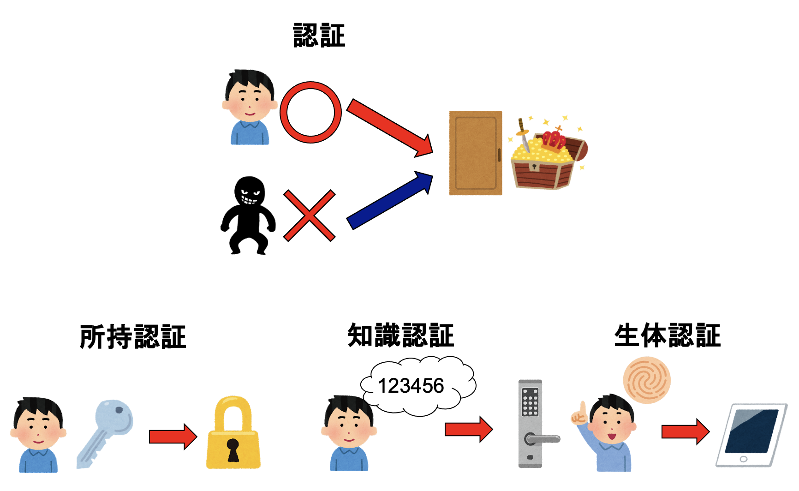
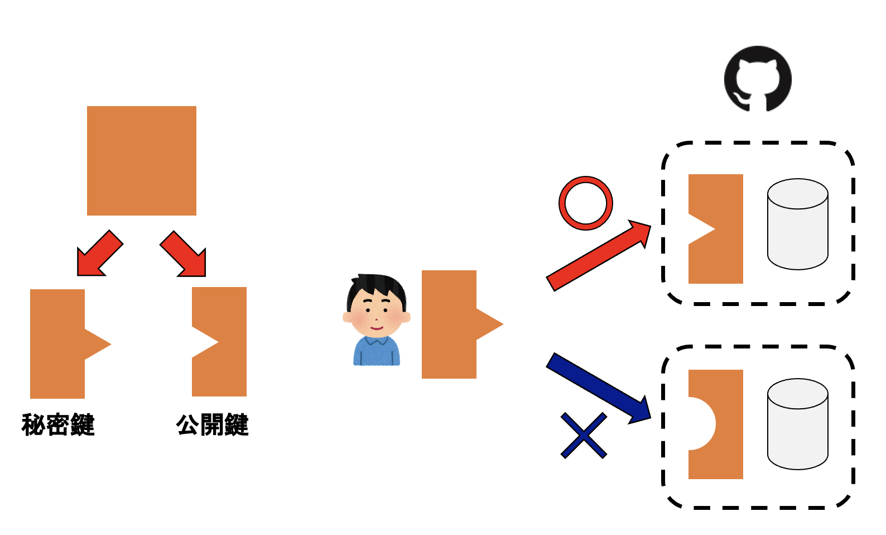

# SSHによる認証

## はじめに

Gitはローカルリポジトリとリモートリポジトリを連携して使う。リモートリポジトリとは文字通りリモートサーバにあるリポジトリであり、ネットワークを介してアクセスすることになる。ネットワーク越しにアクセスする以上、なんらかの方法で通信相手が本当に正しい相手であるかを確認する必要がある。GitのホスティングサービスであるGitHubは複数の認証方法を用意しているが、ここではSSHによる認証について説明する。

## 認証とは



例えば家に帰る時、鍵を開けて入るであろう。これは「この家に入る権利があるのは、このドアの鍵に合う鍵を持っている人である」ということを意味する。一般に、「誰かが何かを行う正当な権利を持っていること」を確認する手続きを認証と呼ぶ。自転車の鍵で、数字を揃えるタイプの鍵を見たことがあるだろう。これは「この自転車を使う権利があるのは、この鍵の数字を知っている人である」という形で認証を行っている。また、タブレットやスマートフォンなどを他の人に勝手に使われると困るので、指紋や顔でロックを外している人も多いだろう。これも認証である。

認証には、大きく分けて「所持認証」「知識認証」「生体認証」の3種類があり、それぞれ特徴がある。「所持認証」とは、特別な物を所有していることをもって、何かの権利があると認証するものだ。例えば家の鍵などがこれにあたる。「知識認証」とは、特別な知識があることにより認証するもので、ナンバー式の鍵などがこれにあたる。「生体認証」とは、指紋認証や顔認証など、体の一部を使って本人であることを確認する方法である。生体認証は広い意味では所持認証の一種であるが、鍵は誰かに貸したり合鍵を作れたりできる一方、指紋認証の場合はそれが難しいなど、運用上の性質がかなり異なるため、別のものとして扱った方が良いだろう。以下では生体認証については扱わない。

## SSH公開鍵認証

例えば手元のPCなどでGitを使う場合、GitはそのPCの中にあるリポジトリ(ローカルリポジトリ)とやりとりをするが、そこでは認証は不要である。そのローカルリポジトリを使えるのはそのPCの持ち主だけであり、PCを持っていることがそのリポジトリにアクセスできる人であると考えられる(所持認証)。また、PCにログイン時にパスワードをかけている場合は知識認証を、指紋や顔認証でロックしている場合は生体認証により守られている。

さて、ローカルリポジトリでなにか行った修正を、GitHubなどのサーバに送りたい。GitHubは

GitHubはネットワークの向こうにあるため、物理的な鍵を使った所持認証を行うことはできない。

GitHubは不特定多数がネットワーク越しにアクセスする関係上、ネットワークのどこからでも見える状態になっていなければならない。すると、Gitのコマンドにより、データがローカルリポジトリからGitHubに送られてきた時、GitHubは「そのデータを送ってきたのは、確かにそのリポジトリにアクセスする権利を持つ人である」ことをなんらかの方法で認証しなければならない。そのために利用されるのがSSH公開鍵認証である。なお、以下の説明はかなり簡略化されたものであり、実際に行われている認証プロセスとは異なることに注意されたい。



SSH公開鍵認証のポイントは、秘密鍵と公開鍵という、2つの鍵を用意することにある。秘密鍵と公開鍵はペアになっており、対応する鍵でなければぴったり一致しない。そこで、予めなんらかの方法で公開鍵をGitHubのサーバに登録しておき、「登録した公開鍵とぴったり合う秘密鍵を持っている人」が、そのリポジトリにアクセスする権利のある人である、という形で認証を行うことにする。これがSSH公開鍵認証の仕組みであり、認証のタイプとしては所持認証にあたる。

## 秘密鍵と公開鍵の生成

初めてSSH公開鍵を使う場合は、`ssh-keygen`で鍵を作ることができる。ターミナルから以下のコマンドを実行する。

```sh
ssh-keygen
```

すると、以下のような表示が出てくる。

```sh
Generating public/private rsa key pair.
Enter file in which to save the key (/c/Users/watanabe/.ssh/id_rsa):
```

これは、「公開鍵、秘密鍵のペアを生成しますよ。保存先の場所を選んでね。何も指定しなければ`/c/Users/watanabe/.ssh/id_rsa`に保存するよ」という意味だ。特に理由がなければそのままエンターを押して良い。

```sh
Enter passphrase (empty for no passphrase):
```

すると、次にパスフレーズを聞かれる。パスフレーズを入力せずにエンターを押すと、パスフレーズなしの秘密鍵が作られるが、 **ここではパスフレーズを入力することを強く推奨する**。なお、パスフレーズを入力しても、画面には何も表示されない(パスフレーズは秘密なので、他の人に見られては困るから)。入力が終わったらエンターキーを押す。

```sh
Enter same passphrase again:
```

もう一度同じパスフレーズを入力し、エンターキーを押す。画面に表示されない状態でパスフレーズを入力したため、もしかしたら入力ミスをしているかもしれない。そこで、もう一度同じパスフレーズを入力し、それが一致していたら正しく入力できたと判断する。

```sh
Your identification has been saved in /c/Users/watanabe/.ssh/id_rsa
Your public key has been saved in /c/Users/watanabe/.ssh/id_rsa.pub
The key fingerprint is:
SHA256:2nMosrJRAKzlDD7zE1qVINL3MYOh6/nTvphyyPUlWCQ watanabe@example.org
The key's randomart image is:
+---[RSA 3072]----+
|+o .oo.          |
|oo+.Eo=          |
|o=o..+ +         |
|.+o=  o          |
|  B oo  S        |
| o =o .o..       |
| .+ooooo+ .      |
|  =oo=o. o       |
|  .==oo.         |
+----[SHA256]-----+
```

パスフレーズの入力が終わると、公開鍵、秘密鍵の保存が行われる。上の例では、秘密鍵のファイル名が`id_rsa`、公開鍵のファイル名は`id_rsa.pub`で、どちらも`/c/Users/watanabe/.ssh/`に、保存されている。fingerprintやrandomart imageも表示されているが、今は気にしなくて良い。以上の操作により、公開鍵と秘密鍵のペアが生成された。

公開鍵は、秘密鍵から作ることができる(逆はできない)。正しく秘密鍵/公開鍵が作られ、パスフレーズが設定されたか確認するために、秘密鍵から公開鍵を作ってみよう。`ssh-keygen`コマンドに`-yf`オプションをつけ、秘密鍵を指定すると、秘密鍵から公開鍵を作ることができる。その際、秘密鍵にパスフレーズが設定されていると、パスフレーズの入力も求められる。

```sh
$ ssh-keygen -yf ~/.ssh/id_rsa
Enter passphrase:
```

ここで先ほど設定したパスフレーズを入力すると、秘密鍵から計算された公開鍵が表示される。

```sh
ssh-rsa AAAAB3NzaC1yc2EAAAADAQABAAABgQD5GvlBtFbKHzjOAEENZz6J2ksxoFJEm4/E8CJW/jFU6Q4RwoZS9cgDAX8rmdeVhfwHcv9dDRHdhoPlvSlhNn0y7aa8tuxzUNvQw/xfK3o0BY1RLZpOoW7uHfYV0heAhCxo5fF7icopP4bBJt6YaaXQrI5HTwjEil4nLOLDdvGLDj+Yfe+LQjdULAHJoThiFA7A9CuWooNbLaktq6dqQhoG75yflw2xqcavmq/ku3CqwH4dITbS0p26quQ2yQkeR2qihn69uI2DEXphlPzaPaFxxA4pxXlTpe4J2AagihhRYgeOx1ygAzktQMU7AuJbmVktlr1uQl++F3fVRmfxCvIe3Qotx/DPp49z9EKl9AvBUfpggnryfUWRXRKvYGObQIg0sP9P0c9xqJX77LAnSg4J72zTi/7kYY/MvxXh5XG/MLG8tQURB+H2q7zPRtOtrQWtxZnAc39KTMaFdsM9LLggjPnizqzM9QcF33ErWHjFQpvSXfXB+7sA6+3tOIfwSJs= watanabe@example.org
```

先ほど作られた公開鍵と比べてみよう。

```sh
$ cat ~/.ssh/id_rsa.pub
ssh-rsa AAAAB3NzaC1yc2EAAAADAQABAAABgQD5GvlBtFbKHzjOAEENZz6J2ksxoFJEm4/E8CJW/jFU6Q4RwoZS9cgDAX8rmdeVhfwHcv9dDRHdhoPlvSlhNn0y7aa8tuxzUNvQw/xfK3o0BY1RLZpOoW7uHfYV0heAhCxo5fF7icopP4bBJt6YaaXQrI5HTwjEil4nLOLDdvGLDj+Yfe+LQjdULAHJoThiFA7A9CuWooNbLaktq6dqQhoG75yflw2xqcavmq/ku3CqwH4dITbS0p26quQ2yQkeR2qihn69uI2DEXphlPzaPaFxxA4pxXlTpe4J2AagihhRYgeOx1ygAzktQMU7AuJbmVktlr1uQl++F3fVRmfxCvIe3Qotx/DPp49z9EKl9AvBUfpggnryfUWRXRKvYGObQIg0sP9P0c9xqJX77LAnSg4J72zTi/7kYY/MvxXh5XG/MLG8tQURB+H2q7zPRtOtrQWtxZnAc39KTMaFdsM9LLggjPnizqzM9QcF33ErWHjFQpvSXfXB+7sA6+3tOIfwSJs= watanabe@example.org
```

全く同じものが表示されていることがわかる。

## 秘密鍵とパスフレーズ

公開鍵は、その名の通り公開するための鍵なので、誰に見られてもかまわない。

* GitHubでも任意の公開鍵が見られる話
* 知識認証と所持認証